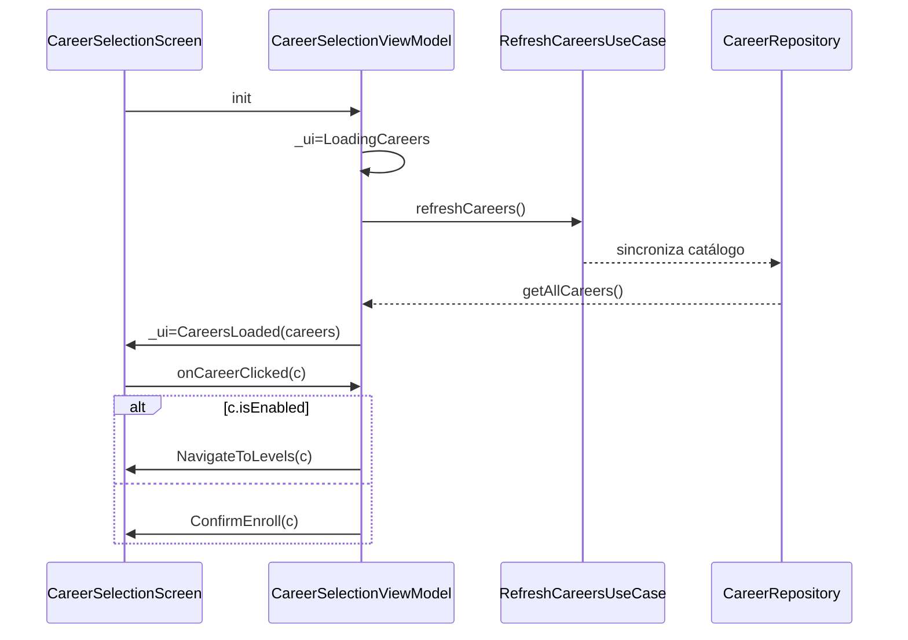

# 4.4 Etapa 3 · Arquitectura y setup del proyecto

## Implementación paso a paso de la arquitectura y setup

### Paso 1: Configuración inicial del proyecto Android
- Crear proyecto Android con Kotlin DSL en `build.gradle.kts`.
- Configurar plugins: `kotlin("android")`, `kotlin("kapt")`, `id("com.google.dagger.hilt.android")`.
- Establecer `compileSdk = 35`, `minSdk = 24`, `targetSdk = 35`.
- Habilitar Jetpack Compose con `buildFeatures { compose = true }`.

### Paso 2: Bootstrap de la aplicación con Hilt
- Crear `TecnoTimeApp.kt` extendiendo `Application`.
- Anotar con `@HiltAndroidApp` para generar grafo de dependencias.
- Inicializar librerías críticas en `onCreate()`: PDFBox, EmojiCompat, ThreeTenABP, canal de notificaciones.

### Paso 3: Configuración de módulos de inyección de dependencias
- Crear `di/AppModule.kt` con proveedores para:
  - SharedPreferences y SyncPreferences.
  - Room database y DAOs.
  - Repositories (Career, Subject, Group, etc.).
  - Servicios AI (AiService, ModelDownloader).
  - Estrategias de scheduling (ScheduleStrategyFactory).
- Crear `di/GsonModule.kt` para serialización JSON.

### Paso 4: Implementación del sistema de theming
- Definir paleta Material 3 en `ui/theme/Color.kt` (light/dark schemes).
- Configurar tipografía Product Sans en `ui/theme/Type.kt`.
- Crear `TecnoTimeTheme` composable con soporte para colores dinámicos.

### Paso 5: Configuración de navegación Compose
- Definir rutas en `presentation/navigation/Screen.kt` usando sealed class.
- Implementar `MainNavGraph` con navegación anidada por flujos.
- Configurar ViewModels compartidos para mantener estado entre pantallas.

### Paso 6: Implementación de WorkManager y Workers
- Crear `AiNotificationWorker` para generación de notificaciones AI.
- Implementar `AiNotificationWorkerFactory` para inyección manual.
- Configurar `NotifyWorker` para notificaciones generales.

### Paso 7: Integración de servicios base
- Conectar notificaciones con `application/notification/*`.
- Preparar infraestructura de sync con `infrastructure/notification/*`.
- Verificar resolución de dependencias en ViewModels.

### Paso 8: Pruebas y validación
- Ejecutar smoke tests de arranque y navegación.
- Verificar inyección de dependencias sin crashes.
- Validar theming aplicado globalmente.

## Resumen ejecutivo
- Objetivo: establecer Clean Architecture, DI con Hilt, navegación con Compose Navigation, trabajos en segundo plano con WorkManager y theming consistente.
- Resultado: aplicación arranca, navegación fluye entre pantallas núcleo, DI resuelve dependencias, y los servicios base (notificaciones/sync) quedan listos para integraciones.

Alcance y criterios
- Entradas: docs/arquitectura.md, docs/tecnologias.md.
- Criterios de aceptación (extracto):
  - `TecnoTimeApp` con `@HiltAndroidApp` y módulos de DI activos.
  - NavHost principal con rutas de selección, generación y ajustes funcionando.
  - WorkManager inicializado y Workers inyectables.
  - Tema Compose aplicado de forma global (colores, tipografías).

Visión de arquitectura (Clean + capas)
```mermaid
flowchart TB
  UI[Presentation (Jetpack Compose)] -->|usa| UC[Domain UseCases]
  UC -->|requiere| REPO[Domain Repositories (interfaces)]
  REPO -->|implementa| DATA[Data layer (Room/Firebase/Scraping)]
  subgraph App Module
    UI
    UC
    REPO
  end
  subgraph Infra
    DATA
  end
```

Convenciones y estructura de paquetes (parcial)
- `presentation/*`: pantallas, navegación, ViewModels.
- `domain/model|repository|usecase|service`: modelos, contratos de repositorios, casos de uso y estrategias.
- `application/notification`, `infrastructure/notification`: orquestación de notificaciones y worker impls.
- `di/*`: módulos Hilt para repositorios, utilidades, serialización.
- `ui/theme/*`: colores, tipografías, tema global.

Bootstrap de la app y DI (Hilt)
- Archivo: `src/main/java/com/example/tecnotime/TecnoTimeApp.kt`
- Componente de aplicación: anotar con `@HiltAndroidApp` para generar el grafo de dependencias. Inicializa librerías críticas como PDFBox, EmojiCompat y ThreeTenABP.

Código real (TecnoTimeApp)
```kotlin
@HiltAndroidApp
class TecnoTimeApp : Application() {
    override fun onCreate() {
        super.onCreate()

        // Inicializa PDFBox (si usas PDFs)
        PDFBoxResourceLoader.init(applicationContext)

        // ✅ Inicializa Emoji2 con el font bundle integrado (retrocompatibilidad hasta API 19)
        EmojiCompat.init(BundledEmojiCompatConfig(this))

        // Inicializa la librería de fechas (ThreeTenABP)
        AndroidThreeTen.init(this)
        if (Build.VERSION.SDK_INT >= Build.VERSION_CODES.O) {
            val channel = NotificationChannel(
                "schedule_channel",
                "Recordatorios de horario",
                NotificationManager.IMPORTANCE_HIGH
            )
            val manager = getSystemService(Context.NOTIFICATION_SERVICE) as NotificationManager
            manager.createNotificationChannel(channel)
        }
    }
}
```

Módulos de DI relevantes
- `di/AppModule.kt`: proveedores de repositorios/servicios principales, incluyendo Room, OkHttp, DAOs, estrategias de scheduling, servicios AI y workers.
- `di/GsonModule.kt`: configuración simple de `Gson` para serialización.
- `infrastructure/notification/NotificationModule.kt`: canales, servicios y estilos de notificación.

Ejemplos de proveedores (patrón)
```kotlin
@Module
@InstallIn(SingletonComponent::class)
object AppModule {
    // SharedPreferences
    @Provides
    @Singleton
    fun provideSharedPreferences(@ApplicationContext ctx: Context): SharedPreferences =
        ctx.getSharedPreferences("sync_prefs", Context.MODE_PRIVATE)

    // Room database
    @Provides
    @Singleton
    fun provideAppDatabase(@ApplicationContext ctx: Context): AppDatabase =
        Room.databaseBuilder(ctx, AppDatabase::class.java, "tecnotime.db")
            .build()

    // Repositories
    @Provides
    @Singleton
    fun provideCareerRepository(dao: CareerDao): CareerRepository =
        CareerRepositoryImpl(dao)

    // AI Services
    @Provides
    @Singleton
    fun provideAiService(
        aiClient: IAiClient,
        userSettingsRepository: UserSettingsRepository,
        runtimeConfigProvider: LlamaRuntimeConfigProvider
    ): AiService = AiService(aiClient, userSettingsRepository, runtimeConfigProvider)

    // Schedule Strategy Factory
    @Provides
    @Singleton
    fun provideScheduleStrategyFactory(): ScheduleStrategyFactory =
        ScheduleStrategyFactory()
}
```

Decisiones tomadas:
- Uso de `@Singleton` para servicios compartidos como database, AI y estrategias.
- Inyección de contextos con `@ApplicationContext` para evitar leaks.
- Separación de módulos por funcionalidad (AppModule para core, GsonModule para serialización).
- Inicialización de librerías en `onCreate` para asegurar disponibilidad temprana.

Theming y estilo global
- Archivos: `ui/theme/Color.kt`, `ui/theme/Type.kt`, `ui/theme/Theme.kt`.
- Definir esquema de color Material 3 completo (light/dark), tipografía con Product Sans, y aplicar `TecnoTimeTheme` globalmente.

Código real (Color.kt - extracto)
```kotlin
// Primary (color principal - rojo intenso)
val md_theme_light_primary = Color(0xFFC62828)            // Red 800
val md_theme_light_onPrimary = Color(0xFFFFFFFF)          // Blanco sobre primary
val md_theme_light_primaryContainer = Color(0xFFFFCDD2)   // Red 200
val md_theme_light_onPrimaryContainer = Color(0xFF410001) // Texto oscuro sobre primaryContainer

// Secondary (color secundario - azul oscuro)
val md_theme_light_secondary = Color(0xFF1565C0)            // Blue 800
val md_theme_light_onSecondary = Color(0xFFFFFFFF)          // Blanco sobre secondary
val md_theme_light_secondaryContainer = Color(0xFFBBDEFB)   // Blue 200
val md_theme_light_onSecondaryContainer = Color(0xFF001C38)  // Texto oscuro sobre secondaryContainer

// Tertiary (color terciario - acento amarillo)
val md_theme_light_tertiary = Color(0xFFFFB300)             // Amber 600
val md_theme_light_onTertiary = Color(0xFF000000)           // Negro sobre tertiary
val md_theme_light_tertiaryContainer = Color(0xFFFFF8E1)    // Amber 100
val md_theme_light_onTertiaryContainer = Color(0xFF331E00)  // Texto oscuro sobre tertiaryContainer
```

Código real (Type.kt - extracto)
```kotlin
val ProductSans = FontFamily(
    Font(resId = R.font.productsans_regular, weight = FontWeight.Normal, style = FontStyle.Normal),
    Font(resId = R.font.productsans_bold, weight = FontWeight.Bold, style = FontStyle.Normal),
    // ... más pesos
)

val Typography = Typography(
    displayLarge = TextStyle(
        fontFamily = ProductSans,
        fontWeight = FontWeight.Black,
        fontSize = 57.sp,
        lineHeight = 64.sp,
        letterSpacing = (-0.25).sp
    ),
    headlineLarge = TextStyle(
        fontFamily = ProductSans,
        fontWeight = FontWeight.Bold,
        fontSize = 32.sp,
        lineHeight = 40.sp,
        letterSpacing = 0.sp
    ),
    // ... más estilos
)
```

Código real (Theme.kt)
```kotlin
@Composable
fun TecnoTimeTheme(
    darkTheme: Boolean = isSystemInDarkTheme(),
    dynamicColor: Boolean = false,
    content: @Composable () -> Unit
) {
    val colorScheme = when {
        dynamicColor && Build.VERSION.SDK_INT >= Build.VERSION_CODES.S -> {
            val context = LocalContext.current
            if (darkTheme) dynamicDarkColorScheme(context) else dynamicLightColorScheme(context)
        }
        darkTheme -> DarkColors
        else -> LightColors
    }

    MaterialTheme(
        colorScheme = colorScheme,
        typography = Typography,
        content = content
    )
}
```

Decisiones tomadas:
- Paleta Material 3 completa con primary (rojo), secondary (azul), tertiary (amarillo).
- Font Product Sans con múltiples pesos para jerarquía tipográfica.
- Soporte para colores dinámicos en Android 12+.
- Tema global aplicado en `MainActivity` o root composable.

Navegación principal (Compose Navigation)
- Archivos: `presentation/navigation/Navigation.kt`, `presentation/navigation/Screen.kt`, `presentation/navigation/viewmodel/MainNavViewModel.kt`.
- Patrón: `sealed class Screen(route)` con argumentos tipados; `NavHost` central con navegación anidada por flujos.

Código real (Screen.kt - extracto)
```kotlin
sealed class Screen(val route: String) {
    // Onboarding
    object Welcome : Screen("welcome")
    object CareerSelection : Screen("career_selection")
    object SubjectsIntro : Screen("subjects_intro")
    object LevelsIntro : Screen("levels_intro")
    object AiIntro : Screen("ai_intro")
    object TeacherFavoritesIntro : Screen("teacher_favorites_intro")
    object TeacherFavorites : Screen("teacher_favorites")

    // Home
    object Home : Screen("home")
    object NotificationDemo : Screen("notification_demo")

    // Add Subject Flow
    object AddSubject : Screen("add_subject")
    object SelectCareerInAddSubject : Screen("add_subject/career")
    object SelectLevel : Screen("add_subject/level")
    object SelectSubject : Screen("add_subject/subject")
    object SelectGroup: Screen("add_subject/group")
    object ColorPicker : Screen("add_subject/color")
    object EmojiPicker : Screen("add_subject/emoji")

    // Generate Schedule
    object GenerateScheduleConfig  : Screen("generate_schedule_config")
    object GenerateScheduleResults : Screen("generate_schedule_results")

    // Career Levels (con argumentos)
    object CareerLevels : Screen("career_levels/{careerCode}/{careerName}?onboarding={onboarding}") {
        fun createRoute(careerCode: String, careerName: String, onboarding: Boolean) =
            "career_levels/$careerCode/$careerName?onboarding=$onboarding"
    }
}
```

Código real (Navigation.kt - extracto)
```kotlin
@Composable
fun MainNavGraph(navController: NavHostController, startDest: String) {
    NavHost(navController = navController, startDestination = startDest) {
        onboardingNavGraph(navController)
        homeNavGraph(navController)
        settingsNavGraph(navController)
        addSubjectNavGraph(navController)
        generateScheduleNavGraph(navController)
        addEventNavGraph(navController)
        editGroupNavGraph(navController)
    }
}

private fun NavGraphBuilder.onboardingNavGraph(navController: NavHostController) {
    navigation(startDestination = Screen.Welcome.route, route = "onboarding") {
        composable(Screen.Welcome.route) { WelcomeScreen(navController) }
        composable(Screen.CareerSelection.route) { CareerSelectionScreen(navController) }
        composable(
            route = Screen.CareerLevels.route,
            arguments = listOf(
                navArgument("careerCode") { type = NavType.StringType },
                navArgument("careerName") { type = NavType.StringType },
                navArgument("onboarding") { type = NavType.BoolType; defaultValue = true }
            )
        ) { backStackEntry ->
            val careerCode = backStackEntry.arguments?.getString("careerCode") ?: ""
            val careerName = backStackEntry.arguments?.getString("careerName") ?: ""
            val isOnboarding = backStackEntry.arguments?.getBoolean("onboarding") ?: true
            CareerLevelsScreen(careerCode, careerName, navController, isOnboarding)
        }
        // ... más pantallas
    }
}

private fun NavGraphBuilder.addSubjectNavGraph(navController: NavHostController) {
    navigation(startDestination = Screen.AddSubject.route, route = "add_subject_flow") {
        composable(Screen.AddSubject.route) { backStackEntry ->
            val parentEntry = remember(backStackEntry) {
                navController.getBackStackEntry("add_subject_flow")
            }
            val sharedVm: AddSubjectViewModel = hiltViewModel(parentEntry)
            AddSubjectFlowScreen(navController, sharedVm)
        }
        composable(Screen.SelectCareerInAddSubject.route) { backStackEntry ->
            val parentEntry = remember(backStackEntry) {
                navController.getBackStackEntry("add_subject_flow")
            }
            val sharedVm: AddSubjectViewModel = hiltViewModel(parentEntry)
            SelectCareerScreen(navController, sharedVm)
        }
        // ... más pantallas con ViewModel compartido
    }
}
```

Decisiones tomadas:
- Navegación anidada por flujos (onboarding, add_subject_flow, etc.) para compartir estado.
- ViewModels compartidos usando `hiltViewModel(parentEntry)` para mantener estado entre pantallas.
- Argumentos tipados con `navArgument` y helpers `createRoute`.
- Separación de navegación por funcionalidad para mantenibilidad.

WorkManager y Workers con Hilt
- Archivos: `domain/ai/service/AiNotificationWorker.kt`, `domain/ai/service/AiNotificationWorkerFactory.kt`, `infrastructure/notification/NotifyWorker.kt`.
- Patrón: `AiNotificationWorker` para notificaciones AI, `NotifyWorker` para notificaciones generales, ambos usando inyección manual vía `WorkerFactory`.

Código real (AiNotificationWorker)
```kotlin
class AiNotificationWorker(
    context: Context,
    workerParams: WorkerParameters,
    private val generateTextUseCase: GenerateTextUseCase,
    private val userSettingsRepository: UserSettingsRepository,
    private val notificationService: NotificationService,
    private val aiService: AiService
) : CoroutineWorker(context, workerParams) {

    override suspend fun doWork(): Result {
        return try {
            val settings = userSettingsRepository.getSettings().first()
            if (settings?.enableAi != true) {
                Log.i(tag, "AI is disabled, skipping notification generation")
                return Result.success()
            }

            val prompt = "Genera un mensaje motivacional breve para estudiantes sobre perseverancia en sus estudios."
            val generatedText = StringBuilder()
            generateTextUseCase(prompt).collect { chunk ->
                generatedText.append(chunk)
            }

            val finalMessage = generatedText.toString().trim()
            if (finalMessage.isNotEmpty()) {
                val notificationInfo = com.example.tecnotime.domain.notification.model.NotificationInfo(
                    id = "ai_motivational_${System.currentTimeMillis()}",
                    title = "Mensaje Motivacional IA",
                    message = finalMessage
                )
                notificationService.scheduleNotification(notificationInfo, 0L)
                Log.i(tag, "AI notification scheduled successfully")
            }

            Result.success()
        } catch (e: Exception) {
            Log.e(tag, "Error in AiNotificationWorker", e)
            Result.failure()
        }
    }
}
```

Código real (AiNotificationWorkerFactory)
```kotlin
class AiNotificationWorkerFactory @Inject constructor(
    private val generateTextUseCase: Provider<GenerateTextUseCase>,
    private val userSettingsRepository: Provider<UserSettingsRepository>,
    private val notificationService: Provider<NotificationService>,
    private val aiService: Provider<AiService>
) : WorkerFactory() {

    override fun createWorker(
        appContext: android.content.Context,
        workerClassName: String,
        workerParameters: WorkerParameters
    ): ListenableWorker? {
        return when (workerClassName) {
            AiNotificationWorker::class.java.name -> {
                AiNotificationWorker(
                    appContext,
                    workerParameters,
                    generateTextUseCase.get(),
                    userSettingsRepository.get(),
                    notificationService.get(),
                    aiService.get()
                )
            }
            else -> null
        }
    }
}
```

Decisiones tomadas:
- Uso de `WorkerFactory` personalizada para inyección manual en lugar de `@HiltWorker` (debido a complejidad con AI).
- `AiNotificationWorker` genera contenido dinámico usando IA y programa notificaciones.
- Separación de responsabilidades: worker para lógica de fondo, factory para inyección.
- Manejo de configuración de usuario (AI habilitada/deshabilitada) dentro del worker.

Configuración de Gradle (extracto)
```kotlin
// build.gradle.kts (módulo app)
plugins {
  id("com.android.application")
  kotlin("android")
  kotlin("kapt")
  id("com.google.dagger.hilt.android")
}

android {
  compileSdk = 35
  defaultConfig { minSdk = 24; targetSdk = 35 }
  buildFeatures { compose = true }
  composeOptions { kotlinCompilerExtensionVersion = "<compose-version>" }
}

dependencies {
  implementation(platform("androidx.compose:compose-bom:<bom>"))
  implementation("androidx.compose.ui:ui")
  implementation("androidx.navigation:navigation-compose:<ver>")
  implementation("com.google.dagger:hilt-android:<ver>")
  kapt("com.google.dagger:hilt-android-compiler:<ver>")
  implementation("androidx.hilt:hilt-work:<ver>")
  kapt("androidx.hilt:hilt-compiler:<ver>")
  implementation("androidx.work:work-runtime-ktx:<ver>")
  implementation("androidx.room:room-ktx:<ver>")
  kapt("androidx.room:room-compiler:<ver>")
}
```

Integraciones clave en esta etapa
- Inyección en ViewModels: `@HiltViewModel` para `*ViewModel.kt` en `presentation/*`.
- Estrategias de dominio inyectadas vía `ScheduleStrategyFactory`.
- Servicios de notificación: `application/notification/*` y `infrastructure/notification/*`.

Desafíos y soluciones
- Ciclos de dependencias entre capas → contratos en `domain/repository` y adaptadores en data/infra. Solución: interfaces en domain, implementaciones en data/infra.
- Inyección en Workers → uso de `WorkerFactory` personalizada (`AiNotificationWorkerFactory`) para inyección manual de dependencias complejas como servicios AI.
- Permisos de notificación (Android 13+) → solicitud previa desde `ui/notification/NotificationPermission.kt`. Canal creado en `TecnoTimeApp.onCreate()`.
- Consistencia de estado de navegación → `MainNavViewModel` como fuente única de verdad para rutas complejas. ViewModels compartidos en flujos anidados.
- Inicialización de librerías → PDFBox, EmojiCompat, ThreeTenABP inicializados en `onCreate` para evitar crashes en runtime.
- Manejo de configuración AI → workers verifican `enableAi` antes de procesar para respetar preferencias de usuario.
- Arquitectura de navegación → separación por flujos (onboarding, add_subject_flow) con ViewModels compartidos para mantener estado entre pantallas.

Pruebas y validación
- Smoke test de arranque: la app abre, muestra Welcome y navega a selección de carrera.
- DI test: resolución de `ScheduleStrategyFactory` y casos de uso claves sin lanzar.
- Navegación: verificación de rutas conocidas en `Navigation.kt`.

Métricas y observabilidad
- Tiempo de arranque frío (cold start) objetivo < 800 ms en dispositivo medio.
- Trazas de navegación (simple logs) para detectar latencias de transición.

Resultados de la etapa
- App arranca con tema aplicado; navegación entre Welcome → Career Selection → Settings.
- DI activa: ViewModels y casos de uso se instancian sin fallos.
- WorkManager listo; worker de notificación compila e inyecta dependencias.

Lecciones aprendidas
- Declarar contratos en `domain` reduce acoplamiento y facilita pruebas.
- Centralizar estilos y rutas evita inconsistencias visuales y de navegación.

Recomendaciones futuras
- Extraer capa data en módulo separado si el tamaño crece (basado en `AppModule.kt` con 500+ líneas).
- Añadir pruebas de navegación con `compose-test` y prewarming de NavHost en CI.
- Implementar `@HiltWorker` para simplificar inyección en workers futuros.
- Optimizar inicialización de librerías (lazy loading para PDFBox si no se usa inmediatamente).
- Agregar métricas de performance para workers (tiempo de ejecución, tasa de éxito).
- Considerar migración a Navigation 3.0 con type-safe routes cuando esté estable.
- Implementar deep links para compartir horarios (usando rutas existentes como base).

Reproducibilidad (pasos)
1) Configurar Android Studio y SDK (ver README.md → Desarrollo).
2) Compilar `assembleDebug` o `assembleRelease`.
3) Instalar e iniciar: verificar pantallas base y logs de DI/Workers.

Módulos/archivos implicados (referencia)
- `src/main/java/com/example/tecnotime/TecnoTimeApp.kt`
- `src/main/java/com/example/tecnotime/di/*`
- `src/main/java/com/example/tecnotime/presentation/navigation/*`
- `src/main/java/com/example/tecnotime/ui/theme/*`
- `src/main/java/com/example/tecnotime/application/notification/*`
- `src/main/java/com/example/tecnotime/infrastructure/notification/*`
- `build.gradle.kts`

DoD específico de la etapa
- App arranca sin crashes, navegación principal operativa.
- DI resuelve dependencias de ViewModels/UseCases/Estrategias.
- Worker de notificación inyectable y registrable en WorkManager.

Especificación de vistas principales y contratos de ViewModel
- CareerSelection
  - VM: `presentation/careerselection/CareerSelectionViewModel.kt`
  - State: `CareerSyncUiState` con variantes `LoadingCareers`, `CareersLoaded`, `ConfirmEnroll`, `ConfirmUnenroll`, `LoadingSubjects`, `RetryInternet`, `FatalError`, `NavigateToLevels`.
  - Eventos expuestos: `loadCareers()`, `onCareerClicked(career)`, `syncCareer(career)`, `unenrollCareer(career)`, `dismissDialog()`.
  - UI: `CareerSelectionScreen` que orquesta `CareerSyncScreen` y `CareerSelectionContent` con dialogs condicionales.
  - Navegación: en `NavigateToLevels`, el Screen realiza `navController.navigate(...)` a niveles.

- AddSubjectFlow
  - VM: `presentation/addsubject/AddSubjectViewModel.kt`
  - State principal: jerarquía `hierarchy: StateFlow<List<CareerWithLevels>>` y selecciones `selectedCareer/Level/Subject/Group`.
  - Derivadas: `levels`, `subjects`, `groups`, `previewSchedules`, `baseWeekly` para comparativas.
  - Edición: `editableSelected` como SSoT de color/emoji/notificaciones.
  - Eventos: `selectCareer/Level/Subject/Group`, `pickColor()`, `pickEmoji()`, `toggleNotification()`, `setNotifyBeforeMinutes()`, `confirmAddSubject()`.
  - Persistencia: `SelectedSubjectRepository.upsertSelectedSubject` al confirmar.

Secuencias de interacción (ejemplo Career Selection)


Navegación avanzada
- Contratos de rutas en `presentation/navigation/Screen.kt` (sealed class) con argumentos tipados.
- Reglas de backstack: mantener estado de selección en `SavedStateHandle` cuando aplica (ej. AddSubjectViewModel).
- Deeplinks (futuro): mapear importación de JSON a una ruta dedicada.

Accesibilidad y temas
- Contraste mínimo AA para colores del tema; tamaño de tipografía base ≥ 14sp.
- Soporte de temas claro/oscuro; componentes reutilizables en `ui/common/*` cumplen tamaños táctiles ≥ 48dp.

Pruebas de UI sugeridas
- Compose UI tests para: carga de carreras, confirm dialogs, flujo AddSubject (selecciones encadenadas), rutas principales.
- Inyección de fakes para repositorios en tests de navegación.
