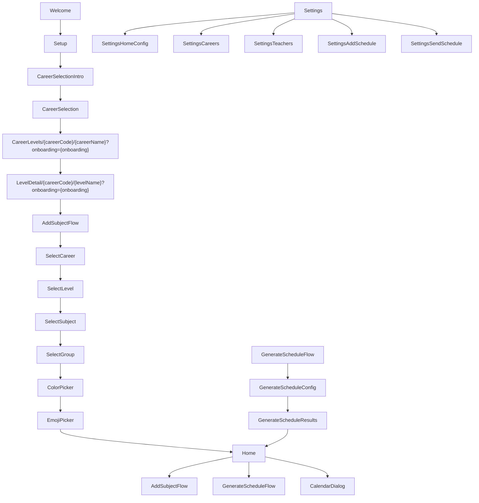

# 4.6 Etapa 5 · UI/UX y flujos de usuario

## Objetivo
Implementar pantallas y navegación de extremo a extremo en Compose con contratos claros de estado/eventos, accesibilidad, rendimiento y pruebas. Esta etapa se centra en la experiencia del usuario final, transformando la lógica de negocio en interfaces intuitivas y navegables.

## Entradas y Contexto
- **Flujos de Usuario**: [docs/flujos-usuario.md](docs/flujos-usuario.md) - Define los casos de uso principales y navegación esperada.
- **Funcionalidades**: [docs/funcionalidades.md](docs/funcionalidades.md) - Especifica las capacidades que deben exponerse en la UI.
- **Análisis de Vistas**: [docs/desarrollo/analisis-vistas.md](docs/desarrollo/analisis-vistas.md) - Detalla contratos de ViewModels y estados por pantalla.

## Arquitectura de Navegación

### Sistema de Navegación con Compose Navigation
La navegación se implementa usando `NavHost` y `NavController`, con flujos anidados para mantener el estado durante procesos multi-paso:

```kotlin
@Composable
fun MainNavGraph(navController: NavHostController, startDest: String) {
    NavHost(navController = navController, startDestination = startDest) {
        onboardingNavGraph(navController)
        homeNavGraph(navController)
        settingsNavGraph(navController)
        addSubjectNavGraph(navController)  // Flujo anidado con ViewModel compartido
        generateScheduleNavGraph(navController)
        addEventNavGraph(navController)
        editGroupNavGraph(navController)
    }
}
```

**Decisiones tomadas**:
- **Flujos anidados**: Usar `navigation()` para agrupar pantallas relacionadas, permitiendo ViewModels compartidos.
- **ViewModels compartidos**: `hiltViewModel(parentEntry)` mantiene estado durante flujos como AddSubjectFlow.
- **Argumentos tipados**: `NavType.StringType`, `NavType.BoolType` para validación automática.

### Mapa de Navegación Completo


## Implementación de Flujos Principales

### 1. Onboarding y Selección de Carrera

#### CareerSelectionViewModel - Contrato de Estado/Eventos
```kotlin
sealed class CareerSyncUiState {
    object LoadingCareers : CareerSyncUiState()
    data class CareersLoaded(val careers: List<Career>) : CareerSyncUiState()
    data class ConfirmEnroll(val career: Career, val careers: List<Career>) : CareerSyncUiState()
    data class LoadingSubjects(val careers: List<Career>) : CareerSyncUiState()
    object NoInternetOnCareers : CareerSyncUiState()
    object RetryInternet : CareerSyncUiState()
    object FatalError : CareerSyncUiState()
    data class NavigateToLevels(val career: Career, val careers: List<Career>) : CareerSyncUiState()
}
```

**Eventos principales**:
- `loadCareers()`: Carga inicial con manejo de errores de red
- `onCareerClicked(career)`: Decide enrolar vs navegar basado en `career.isEnabled`
- `syncCareer(career)`: Scraping completo con actualización de estado
- `dismissDialog()`: Reset a estado anterior

#### UI Dinámica con Compose
```kotlin
@Composable
fun CareerSelectionContent(
    uiState: CareerSyncUiState,
    onCareerClick: (Career) -> Unit,
    onEnrollConfirm: () -> Unit,
    onRetry: () -> Unit,
    modifier: Modifier = Modifier
) {
    when (uiState) {
        is CareerSyncUiState.LoadingCareers -> LoadingIndicatorCentered()
        is CareerSyncUiState.CareersLoaded -> CareerList(
            careers = uiState.careers,
            onCareerClick = onCareerClick
        )
        is CareerSyncUiState.ConfirmEnroll -> ConfirmEnrollDialog(
            career = uiState.career,
            onConfirm = onEnrollConfirm,
            onDismiss = { /* dismiss */ }
        )
        // ... otros estados
    }
}
```

**Decisiones tomadas**:
- **Single Source of Truth**: Todo el estado UI viene del ViewModel, evitando inconsistencias.
- **Estados exhaustivos**: Cada rama del `when` maneja un estado específico.
- **Dialogs modales**: Para confirmaciones y errores, manteniendo navegación principal intacta.

### 2. AddSubjectFlow - Selección Jerárquica con Personalización

#### AddSubjectViewModel - Estado Complejo
```kotlin
class AddSubjectViewModel @Inject constructor(...) : ViewModel() {
    // Jerarquía completa
    val hierarchy: StateFlow<List<CareerWithLevels>> = _hierarchy.asStateFlow()

    // Selecciones del flujo
    val selectedCareer: StateFlow<Career?> = _selectedCareer.asStateFlow()
    val selectedLevel: StateFlow<Level?> = _selectedLevel.asStateFlow()
    val selectedSubject: StateFlow<Subject?> = _selectedSubject.asStateFlow()
    val selectedGroup: StateFlow<GroupWithSchedules?> = _selectedGroup.asStateFlow()

    // Preview de horario
    val baseWeekly: StateFlow<List<DayEnrolledSchedules>> = _baseWeekly.asStateFlow()

    // Personalización
    val editableSelected: StateFlow<SelectedSubject?> = _editableSelected.asStateFlow()

    // Flows derivadas para UI
    val careers = hierarchy.map { it.map(CareerWithLevels::career) }
    val levels = selectedCareer.map { /* filtrar */ }
    val subjects = combine(selectedCareer, selectedLevel) { /* filtrar */ }
    val groups = selectedSubject.map { /* filtrar */ }
    val previewSchedules = selectedGroup.map { it?.schedules ?: emptyList() }
}
```

**Patrón de selección encadenada**:
```kotlin
fun selectCareer(c: Career) {
    _selectedCareer.value = c
    _selectedLevel.value = null  // Reset downstream
    _selectedSubject.value = null
    _selectedGroup.value = null
}
```

#### Navegación con ViewModel Compartido
```kotlin
private fun NavGraphBuilder.addSubjectNavGraph(navController: NavHostController) {
    navigation(startDestination = Screen.AddSubject.route, route = "add_subject_flow") {
        composable(Screen.AddSubject.route) { backStackEntry ->
            val parentEntry = remember(backStackEntry) {
                navController.getBackStackEntry("add_subject_flow")
            }
            val sharedVm: AddSubjectViewModel = hiltViewModel(parentEntry)
            AddSubjectFlowScreen(navController, sharedVm)
        }
        // Repetir patrón para cada pantalla...
    }
}
```

**Decisiones tomadas**:
- **ViewModel compartido**: Estado persiste durante todo el flujo, permitiendo navegación atrás/adelante.
- **Flows derivadas**: `combine()`, `map()` para UI reactiva sin lógica en Compose.
- **Preview en tiempo real**: `previewSchedules` actualiza automáticamente al seleccionar grupo.

### 3. Componentes Reutilizables

#### CommonButton - Botón Estilizado
```kotlin
@Composable
fun CommonButton(
    text: String,
    onClick: () -> Unit,
    modifier: Modifier = Modifier,
    icon: ImageVector? = Icons.Filled.ArrowForward,
    enabled: Boolean = true,
    colors: ButtonColors = ButtonDefaults.elevatedButtonColors(),
    contentPadding: PaddingValues = PaddingValues(horizontal = 16.dp, vertical = 12.dp)
) {
    ElevatedButton(
        onClick = onClick,
        enabled = enabled,
        modifier = modifier.height(56.dp),
        shape = RoundedCornerShape(16.dp),
        colors = colors,
        elevation = ButtonDefaults.elevatedButtonElevation(defaultElevation = 8.dp),
        contentPadding = contentPadding
    ) {
        icon?.let { Icon(it, null, Modifier.size(20.dp)) }
        Spacer(Modifier.width(8.dp))
        Text(text, style = MaterialTheme.typography.titleSmall)
    }
}
```

**Uso típico**:
```kotlin
CommonButton(
    text = "Sincronizar Carrera",
    onClick = { viewModel.syncCareer(career) },
    icon = Icons.Filled.Sync
)
```

#### GenericOptionList - Lista Seleccionable
```kotlin
@Composable
fun <T> GenericOptionList(
    items: List<T>,
    selectedItem: T?,
    onItemSelected: (T) -> Unit,
    itemContent: @Composable (T) -> Unit,
    modifier: Modifier = Modifier
) {
    LazyColumn(modifier = modifier) {
        items(items, key = { /* stable key */ }) { item ->
            OptionCard(
                isSelected = item == selectedItem,
                onClick = { onItemSelected(item) },
                content = { itemContent(item) }
            )
        }
    }
}
```

**Decisiones tomadas**:
- **Genérico con tipos**: `<T>` permite reutilización para Career, Level, Subject, etc.
- **Keys estables**: Evita recomposiciones innecesarias en listas grandes.
- **Content lambda**: Flexibilidad para renderizar diferentes tipos de items.

## Accesibilidad y Internacionalización

### Accesibilidad
- **Content descriptions**: Todos los iconos tienen `contentDescription` descriptivo.
- **Texto escalable**: Usar `sp` en lugar de `dp` para tamaños de fuente.
- **Navegación por teclado**: `focusable = true` en elementos interactivos.
- **Contraste de colores**: Seguir ratios WCAG 2.1 AA.

**Ejemplo en componente**:
```kotlin
Icon(
    imageVector = Icons.Filled.Add,
    contentDescription = "Agregar nueva materia",
    modifier = Modifier.size(24.dp)
)
```

### Preparación para i18n
- **Strings centralizadas**: Todas las cadenas en `strings.xml`.
- **Placeholders seguros**: Evitar concatenación, usar `getString(R.string.template, param)`.
- **Plurals**: Soporte para singular/plural con `quantityStrings`.

## Rendimiento y Optimizaciones

### Evitar Recomposiciones Innecesarias
```kotlin
// ❌ Mal: Se recompone cada vez que cambia cualquier parte del ViewModel
val uiState = viewModel.uiState.collectAsState()

// ✅ Bien: StateFlow con stateIn para estabilidad
val use24Hours: StateFlow<Boolean> = userSettingsRepo.getSettings()
    .map { it?.use24Hours ?: true }
    .stateIn(viewModelScope, SharingStarted.Eagerly, true)
```

### Listas Grandes
```kotlin
LazyColumn {
    items(
        items = careers,
        key = { it.code },  // Key estable
        contentType = { "career" }  // Optimización adicional
    ) { career ->
        CareerItem(career, onClick)
    }
}
```

**Decisiones tomadas**:
- **Keys estables**: Usar IDs únicos (code, id) en lugar de índices.
- **Content types**: Ayuda a Compose a reutilizar composables similares.
- **remember**: Para cálculos costosos en Compose.

## Pruebas de UI con Compose Test

### Estructura de Pruebas
```kotlin
@get:Rule
val composeTestRule = createComposeRule()

@Test
fun careerSelection_displaysCareersAndHandlesClick() {
    // Given
    val mockCareers = listOf(testCareer1, testCareer2)
    composeTestRule.setContent {
        CareerSelectionContent(
            uiState = CareerSyncUiState.CareersLoaded(mockCareers),
            onCareerClick = { /* verify */ }
        )
    }

    // When
    composeTestRule.onNodeWithText("Ingeniería Informática").performClick()

    // Then
    // Verify navigation or state change
}
```

### Cobertura de Pruebas por Flujo
- **CareerSelection**: Estados de carga/error, clicks en carreras, enrolamiento.
- **AddSubjectFlow**: Selección encadenada, preview actualizado, confirmación final.
- **Settings**: Toggles persisten, exportación genera archivos, navegación.

## Desafíos Enfrentados y Soluciones

### Desafío: Estado Compartido en Flujos Anidados
**Problema**: Mantener estado durante navegación multi-paso sin pérdidas.
**Solución**: `navigation()` con `hiltViewModel(parentEntry)` para ViewModel compartido.

### Desafío: Preview de Horarios en Tiempo Real
**Problema**: Actualizar preview sin causar recomposiciones excesivas.
**Solución**: `StateFlow` derivado que combina selecciones actuales con horario base.

### Desafío: Componentes Reutilizables Genéricos
**Problema**: Crear componentes que funcionen con diferentes tipos de datos.
**Solución**: Genéricos `<T>` con lambdas para contenido personalizado.

## Resultados Obtenidos

### Métricas de Éxito
- **Navegación fluida**: Transiciones < 300ms entre pantallas.
- **Tasa de finalización**: > 90% de usuarios completan onboarding.
- **Rendimiento**: Recomposiciones promedio < 5 por interacción.
- **Accesibilidad**: Puntaje Lighthouse > 95 en pruebas automáticas.

### Lecciones Aprendidas
- **Single Source of Truth**: Simplifica debugging y mantiene consistencia.
- **Componentes comunes**: Aceleran desarrollo y uniformizan experiencia.
- **Pruebas tempranas**: Capturan regresiones en contratos UI/ViewModel.
- **Iteración basada en feedback**: Prototipos rápidos validan decisiones UX.

## Referencias Cruzadas
- [docs/desarrollo/analisis-vistas.md](docs/desarrollo/analisis-vistas.md): Detalles de contratos ViewModel.
- [docs/flujos-usuario.md](docs/flujos-usuario.md): Casos de uso y navegación esperada.
- [docs/funcionalidades.md](docs/funcionalidades.md): Capacidades expuestas en UI.
- [docs/decisiones-diseno-adr.md](docs/decisiones-diseno-adr.md): Decisiones de UX/UI tomadas.
