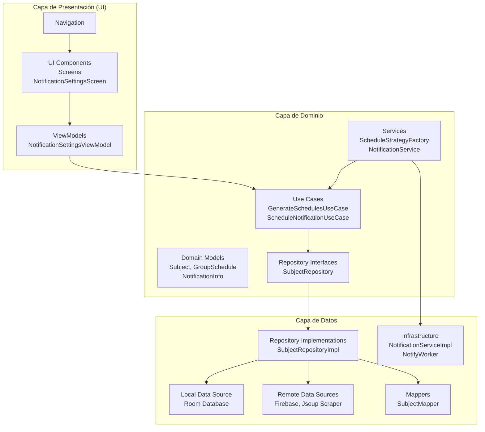

# Arquitectura del Proyecto TecnoTime

## Arquitectura General

TecnoTime sigue los principios de **Clean Architecture**, dividiendo la aplicación en capas bien definidas para mantener la separación de responsabilidades, facilitar las pruebas y promover la escalabilidad. Esta arquitectura permite que la lógica de negocio sea independiente de los frameworks externos y facilita el mantenimiento y evolución del código.

La aplicación está estructurada en tres capas principales: **Presentación**, **Dominio** y **Datos**, siguiendo el patrón de arquitectura limpia propuesto por Robert C. Martin.

## Capas de la Arquitectura

### 1. Capa de Presentación (Presentation Layer)
Esta capa es responsable de la interfaz de usuario y la lógica de presentación, utilizando el patrón **MVVM (Model-View-ViewModel)**.

**Componentes principales:**
- **ViewModels**: Gestionan el estado de la UI, manejan eventos del usuario y coordinan con la capa de dominio. Ejemplos: `GenerateScheduleViewModel`, `HomeViewModel`.
- **Screens**: Componentes de Jetpack Compose que representan las pantallas de la aplicación. Ejemplos: `HomeScreen`, `GenerateScheduleScreen`.
- **Navigation**: Sistema de navegación entre pantallas utilizando Navigation Compose.
- **UI Components**: Componentes reutilizables como `CommonButton`, `SubjectItemRow`, `WeekDayTabs`.

**Responsabilidades:**
- Mostrar datos al usuario de manera atractiva.
- Capturar interacciones del usuario (toques, gestos).
- Gestionar el estado de la interfaz (loading, errores).
- Coordinar la navegación entre diferentes secciones de la app.
- Adaptar los datos del dominio para su presentación.

**Tecnologías utilizadas:**
- Jetpack Compose para la UI declarativa.
- StateFlow y SharedFlow para manejo reactivo del estado.
- ViewModel para sobrevivir a cambios de configuración.

### 2. Capa de Dominio (Domain Layer)
Contiene la lógica de negocio pura, independiente de cualquier framework externo. Esta capa define las reglas de negocio y casos de uso.

**Componentes principales:**
- **Use Cases**: Encapsulan la lógica de negocio específica. Ejemplos: `GenerateSchedulesUseCase`, `GetWeeklyEnrolledScheduleUseCase`.
- **Models**: Modelos de dominio que representan conceptos de negocio. Ejemplos: `Subject`, `GroupSchedule`, `ScheduleGenerationParams`.
- **Repositories Interfaces**: Contratos para acceso a datos. Ejemplos: `SubjectRepository`, `CareerRepository`.
- **Services**: Lógica de negocio compleja. Ejemplos: `ScheduleEvaluationStrategy`, `ScheduleStrategyFactory`.

**Responsabilidades:**
- Definir y ejecutar reglas de negocio.
- Gestionar lógica de aplicación compleja (generación de horarios).
- Proporcionar interfaces abstractas para acceso a datos.
- Ser completamente independiente de Android, bases de datos o servicios externos.
- Gestionar estrategias de optimización para horarios (minimizar gaps, priorizar profesores).

**Características:**
- Utiliza coroutines de Kotlin para operaciones asíncronas.
- Define parámetros para generación de horarios (número de materias, criterios de optimización).
- Implementa algoritmos de backtracking para generación de combinaciones de horarios.

### 3. Capa de Datos (Data Layer)
Maneja el acceso a datos desde múltiples fuentes, implementando los repositorios definidos en la capa de dominio.

**Componentes principales:**
- **Repositories Implementation**: Implementaciones concretas de los repositorios. Ejemplos: `SubjectRepositoryImpl`, `CareerRepositoryImpl`.
- **Data Sources**: Fuentes de datos locales y remotas.
  - **Local**: Room database con DAOs y entidades.
  - **Remote**: Firebase Firestore, scraping con Jsoup.
- **Mappers**: Conversión entre modelos de dominio y entidades de datos. Ejemplos: `SubjectMapper`, `GroupScheduleMapper`.
- **DTOs/Models remotos**: Estructuras para datos externos. Ejemplos: `CareerInfo`, `SubjectInfo`.

**Responsabilidades:**
- Acceso a bases de datos locales (Room/SQLite).
- Sincronización con servicios remotos (Firebase).
- Extracción de datos externos mediante scraping web.
- Cacheo y persistencia de datos.
- Conversión de formatos de datos.
- Manejo de errores de red y datos.

**Tecnologías utilizadas:**
- Room para ORM local.
- Firebase para sincronización.
- Jsoup para parsing HTML.
- Gson para serialización JSON.

### Integración de Notificaciones en las Capas

Las notificaciones están integradas en todas las capas de la arquitectura siguiendo los principios de Clean Architecture, permitiendo una gestión eficiente de alertas y recordatorios relacionados con los horarios académicos. A continuación se describe cómo se integran en cada capa:

#### Domain (Modelos y Configuración)
En la capa de dominio, las notificaciones se representan mediante modelos que definen la estructura de la información de notificación, como `NotificationInfo`, que encapsula detalles como título, mensaje y tipo de notificación. Esta capa también incluye la configuración de notificaciones a través de modelos como `UserSettings`, que permiten definir preferencias de usuario para activar o desactivar notificaciones específicas. Ver [Notificaciones](docs/notificaciones.md) para más detalles sobre los tipos de notificaciones soportadas.

#### Application (Use Cases y Servicios)
La capa de aplicación maneja la lógica de negocio para las notificaciones mediante use cases como `ScheduleNotificationUseCase` y `ShowNotificationUseCase`, que coordinan la programación y visualización de notificaciones basadas en eventos del horario. El servicio `NotificationService` actúa como interfaz para operaciones de notificación, asegurando que la lógica de aplicación sea independiente de las implementaciones concretas. Esta capa también integra estrategias para determinar cuándo y cómo mostrar notificaciones, alineándose con las funcionalidades generales descritas en [Funcionalidades](docs/funcionalidades.md).

#### Infrastructure (Implementaciones y Workers)
En la capa de infraestructura, las notificaciones se implementan mediante `NotificationServiceImpl`, que utiliza APIs nativas de Android para crear y mostrar notificaciones. Los workers como `NotifyWorker` manejan tareas en segundo plano para programar notificaciones recurrentes, utilizando WorkManager para garantizar la ejecución incluso cuando la aplicación no está activa. Esta capa abstrae los detalles técnicos de las plataformas subyacentes, permitiendo cambios en las implementaciones sin afectar las capas superiores.

#### UI (Pantallas de Configuración y Permisos)
La capa de UI incluye pantallas como `NotificationSettingsScreen` para permitir a los usuarios configurar sus preferencias de notificación, y componentes como `NotificationPermission` para gestionar permisos de notificación. Los ViewModels asociados, como `NotificationSettingsViewModel`, coordinan la interacción entre la UI y las capas inferiores, asegurando que los cambios en la configuración se propaguen correctamente. Esta integración permite una experiencia de usuario fluida para la gestión de notificaciones.

Esta integración transversal de notificaciones asegura que sean manejadas de manera coherente y escalable, respetando la separación de responsabilidades de la arquitectura.
## Diagrama de Arquitectura

## Flujo de Datos

1. **Usuario interactúa con UI** → ViewModel recibe el evento.
2. **ViewModel ejecuta Use Case** → Use Case contiene lógica de negocio.
3. **Use Case llama a Repository** → Repository abstrae el acceso a datos.
4. **Repository Implementation accede a Data Sources** → Local (Room) o Remote (Firebase/Scraping).
5. **Datos mapeados regresan** → A través de las capas hasta la UI.

## Patrón de Inyección de Dependencias

- **Hilt** se utiliza para inyección de dependencias, permitiendo que las dependencias fluyan desde las capas externas hacia las internas.
- Los ViewModels son inyectados con Use Cases.
- Los Use Cases son inyectados con Repositories.
- Los Repositories son inyectados con Data Sources.

## Beneficios de Esta Arquitectura

- **Testabilidad**: Cada capa puede ser unitaria e integrada de forma independiente.
- **Mantenibilidad**: Cambios en frameworks (ej. cambiar Room por SQLDelight) afectan solo la capa de datos.
- **Escalabilidad**: Nuevas funcionalidades se agregan sin afectar código existente.
- **Independencia**: La lógica de negocio no depende de Android o servicios externos.
- **Reutilización**: Use Cases pueden ser reutilizados en diferentes contextos.

## Consideraciones de Implementación

- **Coroutines**: Utilizadas en toda la aplicación para operaciones asíncronas.
- **Flow**: Para streams de datos reactivos en ViewModels.
- **Principio de Responsabilidad Única**: Cada clase tiene una única responsabilidad.
- **Principio de Inversión de Dependencias**: Las capas superiores no dependen de las inferiores directamente.

Esta arquitectura sólida proporciona una base robusta para TecnoTime, permitiendo su evolución y mantenimiento a largo plazo.