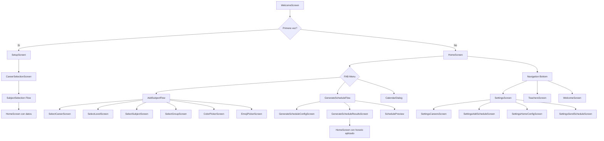
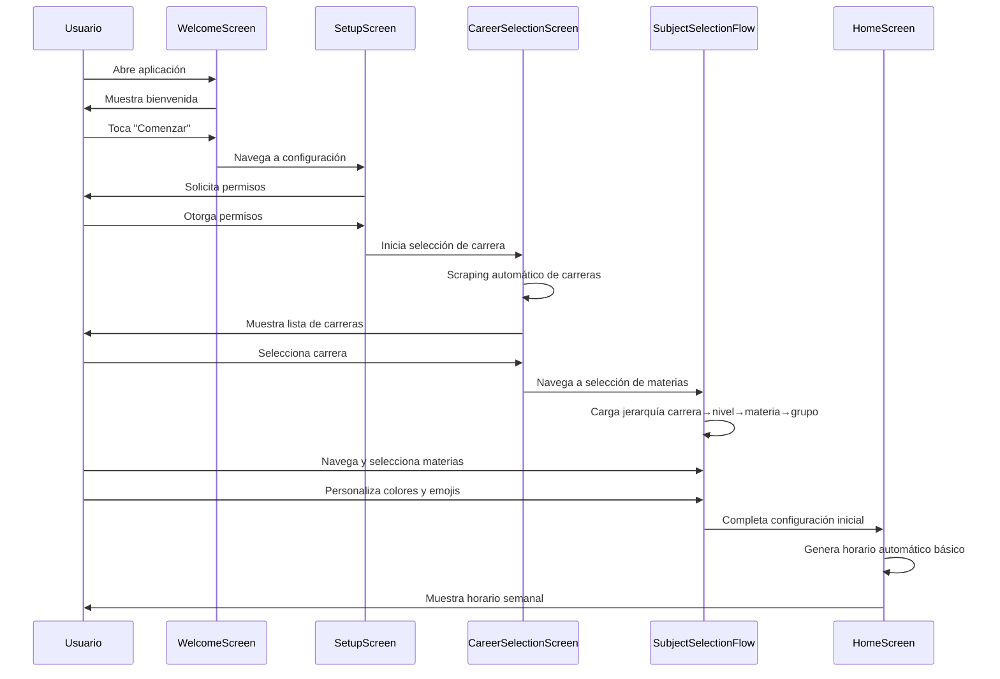
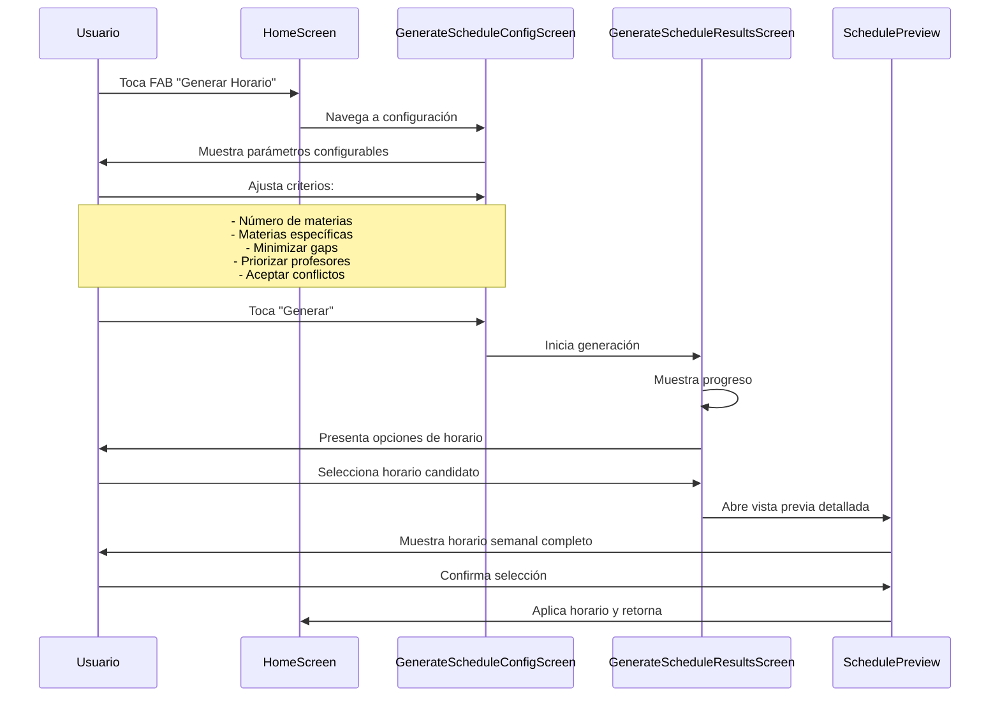
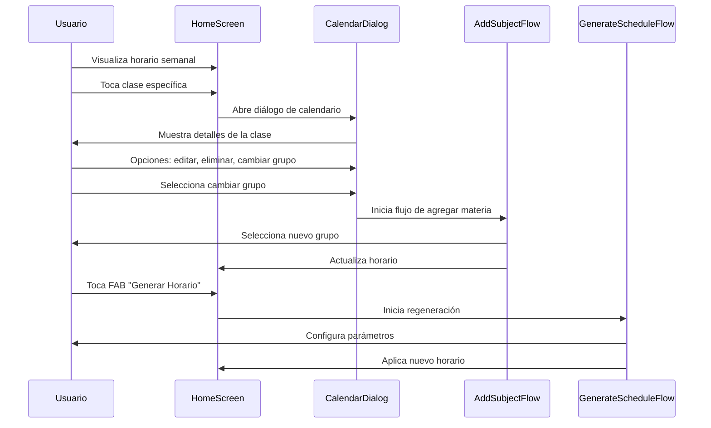
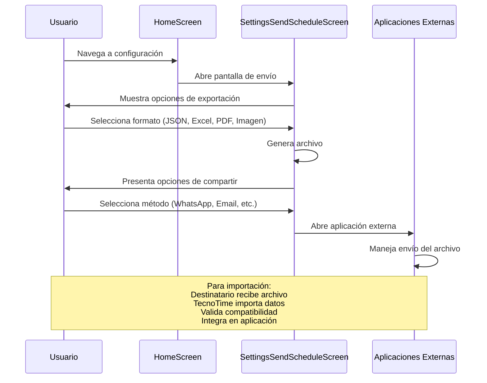

# Flujos de Usuario y Casos de Uso en TecnoTime

## Índice
1. [Introducción](#introducción)
2. [Diagrama de Navegación General](#diagrama-de-navegación-general)
3. [Flujo de Primer Uso](#flujo-de-primer-uso)
4. [Flujo de Generación de Horarios](#flujo-de-generación-de-horarios)
5. [Flujo de Gestión de Horarios Existentes](#flujo-de-gestión-de-horarios-existentes)
6. [Flujo de Compartir y Colaborar](#flujo-de-compartir-y-colaborar)
7. [Casos de Uso Detallados](#casos-de-uso-detailed)
8. [Referencias Cruzadas](#referencias-cruzadas)

## Introducción

TecnoTime está diseñado con una experiencia de usuario intuitiva que guía a los estudiantes a través de procesos complejos de manera simple y visual. Los flujos de usuario están estructurados en torno a tareas académicas principales: configuración inicial, generación de horarios, gestión diaria y colaboración.

Este documento detalla los flujos de usuario con diagramas de navegación y casos de uso, mostrando cómo la aplicación traduce operaciones técnicas complejas en interacciones amigables.

## Diagrama de Navegación General

## Flujo de Primer Uso

### Caso de Uso: Estudiante Nuevo Configura la Aplicación

**Actores**: Estudiante nuevo
**Precondiciones**: Aplicación instalada, sin datos previos
**Postcondiciones**: Base de datos poblada, horario inicial generado

### Pasos Detallados

1. **Bienvenida y Permisos**
   - Pantalla de bienvenida explica propósito
   - Solicitud de permisos (internet, notificaciones, almacenamiento)

2. **Selección de Carrera**
   - Scraping automático desde UMSS
   - Lista filtrable de carreras disponibles
   - Indicador de carga durante scraping

3. **Selección Jerárquica de Materias**
   - Navegación: Carrera → Niveles → Materias → Grupos
   - Visualización de prerrequisitos
   - Personalización visual (colores, emojis)

4. **Configuración Inicial Completa**
   - Generación automática de horario básico
   - Transición a pantalla principal

## Flujo de Generación de Horarios

### Caso de Uso: Generar Horarios Optimizados

**Actores**: Estudiante con materias seleccionadas
**Precondiciones**: Materias configuradas, aplicación con datos
**Postcondiciones**: Múltiples opciones de horario generadas

### Parámetros de Configuración

- **Número de Materias**: Cantidad total a incluir (3-8 típico)
- **Materias Específicas**: Lista opcional de códigos de materia
- **Minimizar Gaps**: Reducir tiempos muertos entre clases
- **Priorizar Profesores**: Favorecer docentes marcados como favoritos
- **Aceptar Conflictos**: Permitir superposiciones si necesario
- **Número de Resultados**: Cantidad de opciones a generar (3-10)

### Proceso de Generación

1. **Validación de Parámetros**
   - Verificación de conflictos básicos
   - Estimación de tiempo de generación

2. **Ejecución del Algoritmo**
   - Barra de progreso con porcentaje
   - Indicador de combinaciones exploradas
   - Posibilidad de cancelación

3. **Presentación de Resultados**
   - Lista de horarios candidatos ordenados por score
   - Vista previa compacta de cada opción
   - Métricas de calidad (gaps totales, días utilizados)

## Flujo de Gestión de Horarios Existentes

### Caso de Uso: Modificar Horario Actual

**Actores**: Estudiante con horario activo
**Precondiciones**: Horario aplicado en la aplicación
**Postcondiciones**: Horario modificado según cambios

### Operaciones de Edición

1. **Cambiar Grupo de Materia**
   - Mantener materia, cambiar grupo/horario
   - Validación de conflictos

2. **Agregar Materia Nueva**
   - Flujo completo de selección
   - Integración con horario existente

3. **Eliminar Materia**
   - Remoción con actualización automática
   - Recálculo de optimizaciones

4. **Agregar Evento Personal**
   - Creación de eventos académicos
   - Integración en calendario

## Flujo de Compartir y Colaborar

### Caso de Uso: Compartir Horario con Compañeros

**Actores**: Estudiante con horario, destinatarios
**Precondiciones**: Horario generado y aplicado
**Postcondiciones**: Horario compartido vía múltiples canales

### Formatos de Exportación

1. **JSON**: Backup completo con metadatos
2. **Excel**: Hoja de cálculo tabular
3. **PDF**: Documento formateado profesional
4. **Imagen**: Captura del horario semanal

### Canales de Compartir

- **Mensajería**: WhatsApp, Telegram, SMS
- **Email**: Adjunto con descripción
- **Almacenamiento**: Drive, Dropbox, local
- **Redes Sociales**: Imagen para compartir

## Casos de Uso Detallados

### CU-001: Scraping de Datos Académicos

**Descripción**: Obtener información actualizada de carreras y horarios
**Actores**: Sistema, UMSS
**Flujo Principal**:
1. Usuario inicia scraping
2. Conectar a sitio UMSS
3. Parsear tabla de carreras
4. Extraer URLs de PDFs
5. Descargar y procesar PDFs
6. Almacenar datos estructurados

**Flujo Alternativo**: Error de conexión → Reintento automático

### CU-002: Generación de Horarios Inteligente

**Descripción**: Crear horarios optimizados basados en criterios
**Actores**: Usuario, Sistema
**Flujo Principal**:
1. Usuario configura parámetros
2. Sistema valida configuración
3. Ejecuta algoritmo de backtracking
4. Aplica estrategias de evaluación
5. Presenta opciones ordenadas
6. Usuario selecciona horario
7. Sistema aplica selección

**Excepciones**: Sin combinaciones válidas → Mensaje explicativo

### CU-003: Sincronización Multi-dispositivo

**Descripción**: Mantener datos consistentes entre dispositivos
**Actores**: Usuario, Firebase
**Flujo Principal**:
1. Detectar cambios locales
2. Subir a Firebase
3. Notificar otros dispositivos
4. Descargar cambios remotos
5. Resolver conflictos automáticamente

### CU-004: Notificaciones de Clases

**Descripción**: Recordatorios automáticos de horarios
**Actores**: Sistema, Usuario
**Flujo Principal**:
1. Programar notificaciones con WorkManager
2. Calcular tiempo de anticipación
3. Mostrar notificación con detalles
4. Permitir interacción (posponer, ver detalles)

## Referencias Cruzadas

- [docs/funcionalidades.md](docs/funcionalidades.md): Funcionalidades detalladas por categoría
- [docs/arquitectura.md](docs/arquitectura.md): Arquitectura de presentación y navegación
- [docs/scraping-parsing-pdf.md](docs/scraping-parsing-pdf.md): Flujo técnico de obtención de datos
- [docs/algoritmos-generacion-horarios.md](docs/algoritmos-generacion-horarios.md): Algoritmos detrás de la generación
- [docs/decisiones-diseno-adr.md](docs/decisiones-diseno-adr.md): Decisiones de UX/UI

Los flujos de usuario en TecnoTime transforman algoritmos complejos en experiencias intuitivas, guiando a los estudiantes desde la configuración inicial hasta la gestión diaria de sus horarios académicos.