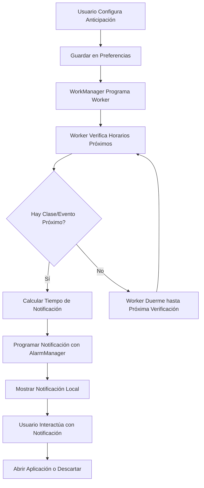
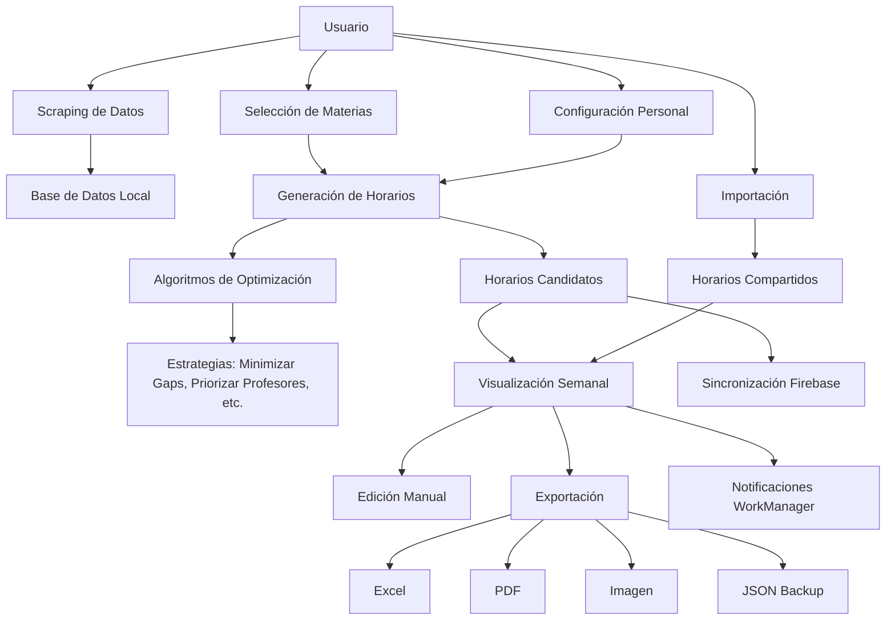

# Funcionalidades Clave de TecnoTime

TecnoTime es una aplicación móvil Android diseñada para estudiantes de la Universidad Mayor de San Simón (UMSS) que facilita la gestión y optimización de horarios académicos. A continuación se detallan las funcionalidades principales organizadas por categorías.

## 1. Gestión de Carreras y Materias

### Scraping Automático de Datos Académicos
- **Extracción Web**: Utiliza Jsoup para hacer scraping del sitio oficial de la UMSS (http://www.fcyt.umss.edu.bo/horarios/).
- **Parsing de Carreras**: Extrae códigos, nombres de carreras y enlaces a PDFs de horarios.
- **Actualización Continua**: Permite refrescar la información académica cuando hay cambios en la oferta curricular.

### Selección Jerárquica de Materias
- **Navegación por Niveles**: Carrera → Niveles → Materias → Grupos disponibles.
- **Personalización Visual**: Asignación de colores y emojis únicos a cada materia para fácil identificación.
- **Gestión de Prerrequisitos**: Validación de materias disponibles según el plan de estudios.

## 2. Generación Inteligente de Horarios

### Algoritmo de Optimización Avanzado
- **Generación Múltiple**: Crea varios horarios candidatos optimizados basados en algoritmos de backtracking.
- **Evaluación Estratégica**: Utiliza diferentes estrategias para calificar y seleccionar los mejores horarios.
- **Combinatoria Inteligente**: Considera todas las combinaciones posibles de grupos sin conflictos de horario.

### Estrategias de Evaluación Configurables
- **Minimizar Espacios Vacíos**: Reduce los gaps entre clases para optimizar el tiempo.
- **Minimizar Días de Clase**: Concentra las clases en menos días para tener más días libres.
- **Priorizar Profesores Favoritos**: Da preferencia a docentes marcados como favoritos por el usuario.
- **Aceptar Conflictos Controlados**: Permite superposiciones si el usuario lo especifica.

### Parámetros de Generación Personalizables
- **Número de Materias**: Cantidad total de asignaturas a incluir en el horario.
- **Materias Específicas**: Opción para generar horarios con asignaturas concretas.
- **Cantidad de Resultados**: Número de horarios alternativos a generar (típicamente 5-10 opciones).

## 3. Visualización y Gestión Interactiva de Horarios

### Interfaz de Calendario Semanal
- **Vista por Días**: Pestañas para cada día de la semana (lunes a domingo).
- **Visualización por Colores**: Cada materia se muestra con su color y emoji asignado.
- **Información Detallada**: Muestra materia, grupo, aula, profesor y horario exacto.

### Edición Manual de Horarios
- **Agregar Eventos**: Creación de eventos académicos personalizados (exámenes, reuniones).
- **Modificar Apariencia**: Cambio de colores y emojis de materias existentes.
- **Cambiar Grupos**: Reasignación de grupos para una misma materia.

## 4. Exportación e Importación de Datos

### Múltiples Formatos de Exportación
- **Excel (.xls)**: Genera hojas de cálculo con formato tabular, incluyendo franjas horarias y días.
- **PDF**: Crea documentos portables con el horario formateado profesionalmente.
- **Imagen**: Captura de pantalla del horario semanal para compartir rápidamente.
- **JSON**: Backup completo de todos los datos para migración o compartición.

### Importación de Horarios Compartidos
- **Carga desde JSON**: Importa horarios creados por otros usuarios.
- **Validación de Datos**: Verifica compatibilidad y consistencia de la información importada.
- **Fusión Inteligente**: Combina horarios importados con datos existentes.

## 5. Sincronización y Persistencia

### Integración con Firebase
- **Autenticación**: Login seguro con Firebase Authentication.
- **Sincronización Multi-dispositivo**: Datos sincronizados automáticamente entre dispositivos del usuario.
- **Backup en la Nube**: Almacenamiento seguro de datos en Firestore.

### Backup Local
- **Exportación JSON**: Creación de archivos de backup locales.
- **Restauración**: Recuperación de datos desde archivos guardados.

## 6. Personalización y Configuración

### Preferencias de Usuario
- **Visualización**: Opción para mostrar/ocultar fines de semana y días sin clases.
- **Notificaciones**: Configuración de recordatorios y alertas.
- **Tema**: Ajustes de apariencia de la aplicación.

### Sistema de Profesores Favoritos
- **Marcado de Preferidos**: Identificación de docentes preferidos.
- **Priorización Automática**: Los algoritmos dan prioridad a estos profesores al generar horarios.

## 7. Sistema de Notificaciones

### Recordatorios Inteligentes
- **Notificaciones de Clases**: Alertas automáticas antes de cada clase.
- **Recordatorios Personalizables**: Configuración de tiempos de anticipación.
- **Trabajo en Segundo Plano**: Utiliza WorkManager para notificaciones programadas.

## 8. Sistema de Notificaciones Locales

### Notificaciones de Clases y Eventos
El sistema de notificaciones locales permite a los usuarios recibir alertas automáticas para clases programadas y eventos académicos personalizados. Las notificaciones de clases se activan automáticamente basadas en el horario semanal generado, mientras que las notificaciones de eventos se configuran manualmente al crear eventos en el calendario. Cada notificación incluye información detallada como el nombre de la materia, aula, profesor y tiempo restante hasta el inicio.

### Configuración de Anticipación
Los usuarios pueden personalizar el tiempo de anticipación para las notificaciones, con opciones predefinidas de 5, 10, 15, 30 minutos o 1 hora antes del evento. Esta configuración se almacena en las preferencias del usuario y se aplica a todas las notificaciones programadas. Para más detalles sobre la configuración de notificaciones, consulta [docs/notificaciones.md](docs/notificaciones.md).

### Trabajo en Segundo Plano con WorkManager
El sistema utiliza WorkManager de Android para manejar el trabajo en segundo plano de las notificaciones. WorkManager garantiza que las notificaciones se programen y ejecuten de manera confiable, incluso si la aplicación no está en primer plano o el dispositivo se reinicia. Los workers se programan periódicamente para verificar horarios próximos y activar notificaciones en el momento adecuado. Esta implementación asegura eficiencia energética y compatibilidad con las restricciones de batería de Android. Para información sobre la arquitectura general, incluyendo WorkManager, ver [docs/arquitectura.md](docs/arquitectura.md).

### Diagrama de Flujo de Notificaciones

## Diagrama de Funcionalidades Principales

## Flujos de Usuario Principales

### 1. Primer Uso - Estudiante Nuevo
1. Scraping automático de carreras disponibles.
2. Selección de carrera y nivel.
3. Elección de materias con personalización visual.
4. Generación de horarios optimizados.
5. Selección y aplicación del mejor horario.
6. Exportación para impresión o referencia.

### 2. Modificación de Horario Existente
1. Visualización del horario actual.
2. Edición manual (cambio de grupos, agregar eventos).
3. Regeneración con nuevos parámetros.
4. Aplicación de cambios.
5. Sincronización con otros dispositivos.

### 3. Compartir y Colaborar
1. Exportación del horario en formato JSON.
2. Compartir vía redes sociales o mensajería.
3. Otros usuarios pueden importar y adaptar el horario.

### 4. Backup y Restauración
1. Exportación periódica de datos en JSON.
2. Almacenamiento en almacenamiento local o nube.
3. Restauración en caso de cambio de dispositivo o pérdida de datos.

## Beneficios para el Usuario

- **Ahorro de Tiempo**: Generación automática vs. planificación manual.
- **Optimización**: Horarios adaptados a preferencias personales.
- **Flexibilidad**: Múltiples formatos de exportación.
- **Colaboración**: Compartir horarios con compañeros.
- **Persistencia**: Datos seguros con backup y sincronización.

Estas funcionalidades convierten a TecnoTime en una herramienta integral para la gestión académica universitaria, combinando automatización inteligente con control manual del usuario.