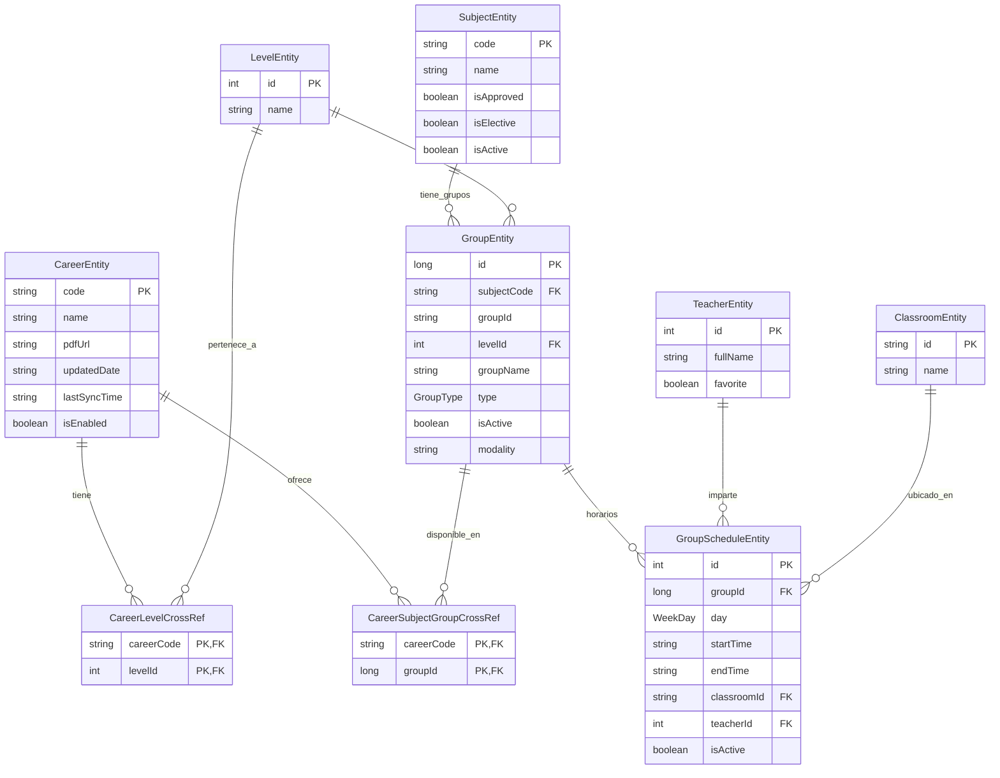

# Modelo de Datos y Diagramas ER en TecnoTime

## Índice
1. [Introducción](#introducción)
2. [Entidades Principales](#entidades-principales)
3. [Relaciones Many-to-Many](#relaciones-many-to-many)
4. [Diagrama ER General](#diagrama-er-general)
5. [Constraints y Reglas de Integridad](#constraints-y-reglas-de-integridad)
6. [Relaciones de Agregación](#relaciones-de-agregación)
7. [Mapeo Objeto-Relacional](#mapeo-objeto-relacional)
8. [Referencias Cruzadas](#referencias-cruzadas)

## Introducción

El modelo de datos de TecnoTime está diseñado para representar la estructura académica compleja de la Universidad Mayor de San Simón, capturando relaciones jerárquicas entre carreras, niveles, materias, grupos y horarios. Utilizando Room como ORM sobre SQLite, el modelo soporta consultas eficientes y mantiene integridad referencial.

Este documento presenta los diagramas Entidad-Relación (ER) detallados, explicando cada entidad, sus atributos y las relaciones que conectan el dominio académico.

## Entidades Principales

### CareerEntity (Carreras)
```kotlin
@Entity(
    tableName = "careers",
    indices = [
        Index(value = ["name"], unique = true),
        Index(value = ["pdf_url"], unique = true)
    ]
)
data class CareerEntity(
    @PrimaryKey
    val code: String,           // Código único (ej: "409701")

    val name: String,           // Nombre completo

    val pdfUrl: String,         // URL del PDF de horarios

    val updatedDate: String,    // Fecha de última actualización

    val lastSyncTime: String?,  // Timestamp de última sincronización

    val isEnabled: Boolean = false // Si está disponible para selección
)
```

**Atributos Clave**:
- `code`: Identificador único alfanumérico
- `pdfUrl`: Enlace directo al documento fuente
- `lastSyncTime`: Control de versión para actualizaciones

### SubjectEntity (Materias)
```kotlin
@Entity(
    tableName = "subjects",
    indices = [Index(value = ["code"], unique = true)]
)
data class SubjectEntity(
    @PrimaryKey
    val code: String,           // Código único (ej: "2006063")

    val name: String,           // Nombre completo

    val isApproved: Boolean = false, // Si el estudiante la aprobó

    val isElective: Boolean = false, // Si es optativa

    val isActive: Boolean = true     // Si está disponible
)
```

**Atributos Clave**:
- `code`: Identificador numérico de 7 dígitos
- Estados académicos: `isApproved`, `isElective`, `isActive`

### LevelEntity (Niveles)
```kotlin
@Entity(
    tableName = "levels",
    indices = [Index(value = ["name"], unique = true)]
)
data class LevelEntity(
    @PrimaryKey(autoGenerate = true)
    val id: Int = 0,

    val name: String            // Nombre del nivel (ej: "A", "B", "1er Semestre")
)
```

**Atributos Clave**:
- `id`: Clave primaria autogenerada
- `name`: Identificador jerárquico dentro de carrera

### GroupEntity (Grupos)
```kotlin
@Entity(
    tableName = "groups",
    indices = [
        Index(value = ["subject_code","group_id"], unique = true),
        Index("level_id")
    ],
    foreignKeys = [
        ForeignKey(entity = LevelEntity::class, parentColumns = ["id"], childColumns = ["level_id"], onDelete = ForeignKey.CASCADE),
        ForeignKey(entity = SubjectEntity::class, parentColumns = ["code"], childColumns = ["subject_code"], onDelete = ForeignKey.CASCADE)
    ]
)
data class GroupEntity(
    @PrimaryKey(autoGenerate = true)
    val id: Long = 0,

    val subjectCode: String,     // FK a SubjectEntity.code

    val groupId: String,         // Identificador del grupo (ej: "1", "2A")

    val levelId: Int,            // FK a LevelEntity.id

    val groupName: String,       // Nombre descriptivo

    val type: GroupType = GroupType.T, // Teoría, Práctica, etc.

    val isActive: Boolean = true,

    val modality: String? = null // Presencial, virtual, etc.
)
```

**Atributos Clave**:
- `id`: Clave primaria autogenerada
- `subjectCode` + `groupId`: Identificador compuesto único
- `type`: Enum para tipo de clase (T, P, TP, L)

### GroupScheduleEntity (Horarios de Grupos)
```kotlin
@Entity(
    tableName = "group_schedules",
    foreignKeys = [
        ForeignKey(entity = GroupEntity::class, parentColumns = ["id"], childColumns = ["group_id"], onDelete = ForeignKey.CASCADE),
        ForeignKey(entity = ClassroomEntity::class, parentColumns = ["id"], childColumns = ["classroom_id"], onDelete = ForeignKey.SET_NULL),
        ForeignKey(entity = TeacherEntity::class, parentColumns = ["id"], childColumns = ["teacher_id"], onDelete = ForeignKey.SET_NULL)
    ],
    indices = [
        Index(value = ["group_id"]),
        Index(value = ["classroom_id"]),
        Index(value = ["teacher_id"])
    ]
)
data class GroupScheduleEntity(
    @PrimaryKey(autoGenerate = true)
    val id: Int = 0,

    val groupId: Long,           // FK a GroupEntity.id

    val day: WeekDay,            // Enum: MONDAY, TUESDAY, etc.

    val startTime: String,       // HH:MM

    val endTime: String,         // HH:MM

    val classroomId: String?,    // FK a ClassroomEntity.id

    val teacherId: Int?,         // FK a TeacherEntity.id

    val isActive: Boolean = true
)
```

**Atributos Clave**:
- `day`: Enum tipado para días de semana
- `startTime`/`endTime`: Strings para flexibilidad de formato
- Foreign keys opcionales con SET_NULL para manejar datos faltantes

### TeacherEntity (Docentes)
```kotlin
@Entity(
    tableName = "teachers",
    indices = [Index(value = ["full_name"], unique = true)]
)
data class TeacherEntity(
    @PrimaryKey(autoGenerate = true)
    val id: Int = 0,

    val fullName: String,

    val favorite: Boolean = false
)
```

**Atributos Clave**:
- `favorite`: Flag para preferencias de usuario

### ClassroomEntity (Aulas)
```kotlin
@Entity(
    tableName = "classrooms",
    indices = [Index(value = ["name"], unique = true)]
)
data class ClassroomEntity(
    @PrimaryKey
    val id: String,              // Ej: "B-201"

    val name: String
)
```

**Atributos Clave**:
- `id`: Identificador alfanumérico único

## Relaciones Many-to-Many

### CareerLevelCrossRef (Carrera-Nivel)
```kotlin
@Entity(
    tableName = "career_level_cross_ref",
    primaryKeys = ["career_code", "level_id"],
    foreignKeys = [
        ForeignKey(entity = CareerEntity::class, parentColumns = ["code"], childColumns = ["career_code"], onDelete = ForeignKey.CASCADE),
        ForeignKey(entity = LevelEntity::class, parentColumns = ["id"], childColumns = ["level_id"], onDelete = ForeignKey.CASCADE)
    ]
)
data class CareerLevelCrossRef(
    val careerCode: String,
    val levelId: Int
)
```

### CareerSubjectGroupCrossRef (Carrera-Grupo)
```kotlin
@Entity(
    tableName = "career_subject_group_cross_ref",
    primaryKeys = ["career_code", "group_id"],
    foreignKeys = [
        ForeignKey(entity = CareerEntity::class, parentColumns = ["code"], childColumns = ["career_code"], onDelete = ForeignKey.CASCADE),
        ForeignKey(entity = GroupEntity::class, parentColumns = ["id"], childColumns = ["group_id"], onDelete = ForeignKey.CASCADE)
    ]
)
data class CareerSubjectGroupCrossRef(
    val careerCode: String,
    val groupId: Long
)
```

## Diagrama ER General



## Constraints y Reglas de Integridad

### Constraints de Integridad Referencial

1. **Cascada en Eliminación**:
   - Eliminar una `CareerEntity` elimina todas sus referencias en cross-refs
   - Eliminar un `LevelEntity` elimina grupos asociados
   - Eliminar un `SubjectEntity` elimina grupos asociados

2. **SET NULL en Opcionales**:
   - `GroupScheduleEntity.classroomId` y `teacherId` se ponen a NULL si se elimina la entidad referenciada

### Constraints Únicos

1. **Carreras**: `name` y `pdfUrl` únicos
2. **Materias**: `code` único
3. **Niveles**: `name` único
4. **Grupos**: `(subjectCode, groupId)` único
5. **Docentes**: `fullName` único
6. **Aulas**: `name` único

### Constraints de Negocio

1. **Horarios Válidos**: `startTime < endTime`
2. **Grupos Activos**: Solo grupos activos generan horarios
3. **Materias Aprobadas**: Flag `isApproved` para tracking académico

## Relaciones de Agregación

### CareerWithLevelsRelation
```kotlin
data class CareerWithLevelsRelation(
    @Embedded val career: CareerEntity,
    @Relation(
        parentColumn = "code",
        entityColumn = "id",
        associateBy = Junction(
            value = CareerLevelCrossRef::class,
            parentColumn = "career_code",
            entityColumn = "level_id"
        )
    )
    val levels: List<LevelEntity>
)
```

### GroupScheduleWithDetailsRelation
```kotlin
data class GroupScheduleWithDetailsRelation(
    @Embedded val schedule: GroupScheduleEntity,

    @Relation(
        parentColumn = "teacher_id",
        entityColumn = "id"
    )
    val teacher: TeacherEntity?,

    @Relation(
        parentColumn = "classroom_id",
        entityColumn = "id"
    )
    val classroom: ClassroomEntity?
)
```

## Mapeo Objeto-Relacional

### Patrón Repository

Cada entidad tiene su correspondiente Repository que abstrae el acceso a datos:

- `CareerRepository` → `CareerEntity`
- `SubjectRepository` → `SubjectEntity`
- `GroupRepository` → `GroupEntity`
- etc.

### Mappers

Clases utilitarias para conversión entre entidades de datos y modelos de dominio:

```kotlin
object SubjectMapper {
    fun entityToDomain(entity: SubjectEntity): Subject
    fun domainToEntity(domain: Subject): SubjectEntity
}
```

### Queries Complejas

Room permite queries con JOIN implícitos mediante relaciones:

```kotlin
@Query("""
    SELECT * FROM careers
    WHERE code IN (
        SELECT DISTINCT career_code
        FROM career_subject_group_cross_ref
        WHERE group_id IN (
            SELECT id FROM groups
            WHERE subject_code = :subjectCode
        )
    )
""")
fun findCareersBySubject(subjectCode: String): List<CareerEntity>
```

## Referencias Cruzadas

- [docs/arquitectura.md](docs/arquitectura.md): Arquitectura de capas y repositorios
- [docs/scraping-parsing-pdf.md](docs/scraping-parsing-pdf.md): Origen de los datos
- [docs/algoritmos-generacion-horarios.md](docs/algoritmos-generacion-horarios.md): Uso de los datos en algoritmos
- [docs/decisiones-diseno-adr.md](docs/decisiones-diseno-adr.md): Decisiones sobre modelo de datos
- [docs/ejemplos-codigo.md](docs/ejemplos-codigo.md): Implementación de queries y mappers

El modelo de datos de TecnoTime proporciona una base sólida para representar la complejidad académica universitaria, soportando consultas eficientes y manteniendo integridad en un dominio con relaciones many-to-many intrínsecas.