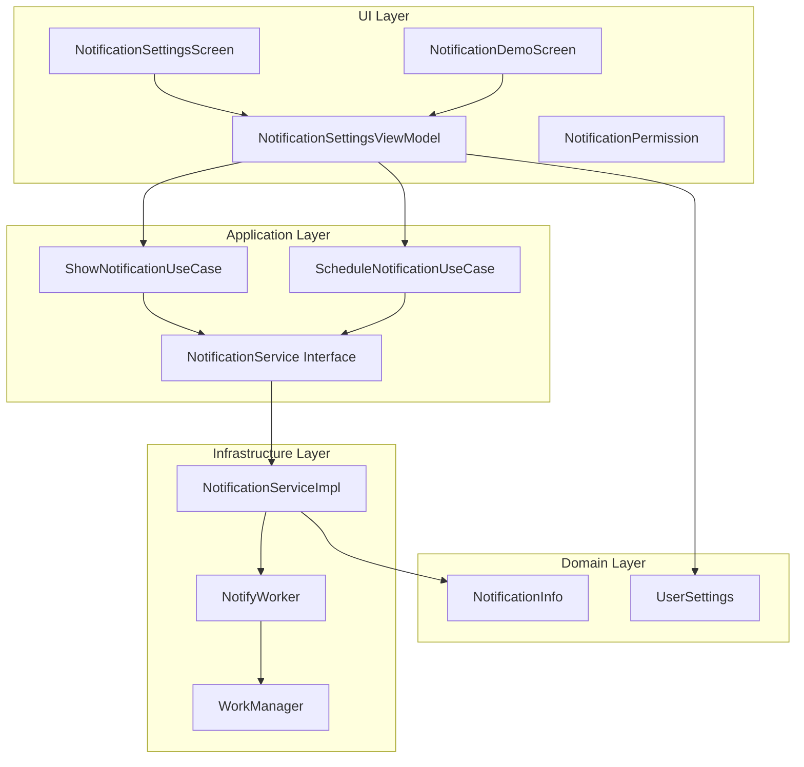
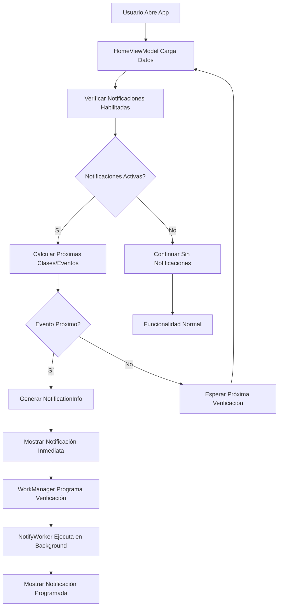

# Sistema de Notificaciones Locales en TecnoTime

## Índice

1. [Introducción](#introducción)
2. [Arquitectura del Sistema de Notificaciones](#arquitectura-del-sistema-de-notificaciones)
3. [Funcionamiento Detallado](#funcionamiento-detallado)
4. [Configuración de Notificaciones](#configuración-de-notificaciones)
5. [Interfaz de Usuario](#interfaz-de-usuario)
6. [Cambios Realizados](#cambios-realizados)
7. [Diagramas](#diagramas)

## Introducción

El sistema de notificaciones locales de TecnoTime permite a los usuarios recibir alertas automáticas sobre clases programadas y eventos académicos personalizados. Este sistema mejora la experiencia del usuario al proporcionar recordatorios oportunos, ayudando a los estudiantes a gestionar mejor su tiempo académico.

Las notificaciones se dividen en dos tipos principales:
- **Notificaciones de clases**: Alertas automáticas basadas en el horario semanal generado
- **Notificaciones de eventos**: Recordatorios para eventos académicos personalizados creados por el usuario

## Arquitectura del Sistema de Notificaciones

El sistema de notificaciones sigue la arquitectura limpia de TecnoTime, distribuyéndose en las siguientes capas:

### Capa de Dominio (Domain)
- **`NotificationInfo`**: Modelo de datos que representa la información básica de una notificación (id, título, mensaje)
- **`UserSettings`**: Modelo que incluye configuraciones de notificaciones como habilitación y tiempos de anticipación

### Capa de Aplicación (Application)
- **`NotificationService`**: Interfaz que define las operaciones de notificación
- **`ShowNotificationUseCase`**: Caso de uso para mostrar notificaciones inmediatas
- **`ScheduleNotificationUseCase`**: Caso de uso para programar notificaciones diferidas

### Capa de Infraestructura (Infrastructure)
- **`NotificationServiceImpl`**: Implementación concreta que utiliza APIs nativas de Android para crear y mostrar notificaciones
- **`NotifyWorker`**: Worker de WorkManager que ejecuta notificaciones programadas en segundo plano

### Capa de UI (Presentación)
- **`NotificationSettingsScreen`**: Pantalla para configurar preferencias de notificación
- **`NotificationSettingsViewModel`**: ViewModel que gestiona el estado de configuración
- **`NotificationDemoScreen`**: Pantalla de demostración para probar notificaciones
- **`NotificationPermission`**: Componente para solicitar permisos de notificación

Para más detalles sobre la arquitectura general, consulta [docs/arquitectura.md](docs/arquitectura.md).

## Funcionamiento Detallado

### Notificaciones Inmediatas

Las notificaciones inmediatas se muestran instantáneamente cuando se cumple una condición específica. En TecnoTime, se utilizan principalmente para alertar sobre clases o eventos próximos.

**Lógica en HomeViewModel:**

```kotlin
private suspend fun checkUpcomingClasses(week: List<DayEnrolledSchedules>) {
    val settings = settingsRepo.getSettings().firstOrNull()
    if (settings?.enableClassNotifications != true) return

    val currentTime: LocalTime = LocalTime.now()
    val currentMinutes: Int = currentTime.hour * 60 + currentTime.minute
    val todayDay: WeekDay = mapToWeekDay(System.currentTimeMillis())
    val todaySchedules: List<EnrolledSchedulePreview> = week.firstOrNull { it.day == todayDay }?.entries.orEmpty()

    for (entry in todaySchedules.sortedBy { it.schedule.startTime.toMinutes() }) {
        val startMinutes: Int = entry.schedule.startTime.toMinutes()
        val diff: Duration = Duration.ofMinutes((startMinutes - currentMinutes).toLong())
        if (diff.toMinutes() in 1..settings.classNotificationAdvanceMinutes) {
            val notification = NotificationInfo(
                id = "upcoming_class_${entry.selectedSubject.id}_${System.currentTimeMillis()}",
                title = "Clase próxima",
                message = "La clase de ${entry.subject.name} comienza en ${diff.toMinutes()} minutos"
            )
            showNotification(notification)
            break // solo mostrar una notificación por vez
        }
    }
}
```

Esta función:
1. Verifica si las notificaciones de clases están habilitadas
2. Obtiene la hora actual y calcula minutos transcurridos del día
3. Filtra las clases del día actual
4. Para cada clase, calcula el tiempo restante hasta el inicio
5. Si el tiempo restante está dentro del rango configurado, muestra una notificación

### Notificaciones Programadas

Las notificaciones programadas se ejecutan en un momento futuro utilizando WorkManager. Se utilizan para notificaciones que deben aparecer incluso si la aplicación no está activa.

**Implementación con WorkManager:**

```kotlin
override fun scheduleNotification(notification: NotificationInfo, delayMillis: Long) {
    val workRequest = OneTimeWorkRequestBuilder<NotifyWorker>()
        .setInitialDelay(delayMillis, TimeUnit.MILLISECONDS)
        .setInputData(
            androidx.work.Data.Builder()
                .putString("id", notification.id)
                .putString("title", notification.title)
                .putString("message", notification.message)
                .build()
        )
        .build()

    WorkManager.getInstance(context).enqueue(workRequest)
}
```

El `NotifyWorker` procesa la notificación programada:

```kotlin
override fun doWork(): Result {
    val id = inputData.getString("id") ?: return Result.failure()
    val title = inputData.getString("title") ?: return Result.failure()
    val message = inputData.getString("message") ?: return Result.failure()

    val notificationManager = applicationContext.getSystemService(Context.NOTIFICATION_SERVICE) as NotificationManager

    val channel = NotificationChannel("default", "Default", NotificationManager.IMPORTANCE_DEFAULT)
    notificationManager.createNotificationChannel(channel)

    val builder = NotificationCompat.Builder(applicationContext, "default")
        .setSmallIcon(android.R.drawable.ic_notification_overlay)
        .setContentTitle(title)
        .setContentText(message)
        .setPriority(NotificationCompat.PRIORITY_DEFAULT)

    notificationManager.notify(id.hashCode(), builder.build())

    return Result.success()
}
```

### Lógica de Eventos en HomeViewModel

Similar a las clases, los eventos académicos también generan notificaciones:

```kotlin
private suspend fun checkUpcomingEvents() {
    val settings = settingsRepo.getSettings().firstOrNull()
    if (settings?.enableEventNotifications != true) return

    val allEvents = eventRepo.getAllEvents().firstOrNull() ?: emptyList()
    val currentTime = System.currentTimeMillis()
    val fmt = SimpleDateFormat("yyyy-MM-dd", Locale.getDefault())

    for (event in allEvents.sortedBy { it.startTime }) {
        // Cálculo de tiempo hasta el evento...
        if (diffHours in 0.0..settings.eventNotificationAdvanceHours.toDouble()) {
            val notification = NotificationInfo(
                id = "upcoming_event_${event.id}_${System.currentTimeMillis()}",
                title = "Evento próximo",
                message = "El evento '${event.title}' comienza en ${String.format("%.1f", diffHours)} horas"
            )
            showNotification(notification)
            break
        }
    }
}
```

## Configuración de Notificaciones

### UserSettings

El modelo `UserSettings` incluye las siguientes propiedades relacionadas con notificaciones:

```kotlin
data class UserSettings(
    // ... otras propiedades
    val enableClassNotifications: Boolean = true,
    val classNotificationAdvanceMinutes: Int = 10,
    val enableEventNotifications: Boolean = true,
    val eventNotificationAdvanceHours: Int = 1
)
```

- **`enableClassNotifications`**: Habilita/deshabilita notificaciones de clases
- **`classNotificationAdvanceMinutes`**: Minutos de anticipación para clases (5, 10, 15 minutos)
- **`enableEventNotifications`**: Habilita/deshabilita notificaciones de eventos
- **`eventNotificationAdvanceHours`**: Horas de anticipación para eventos (1, 2, 24 horas)

### Anticipación Configurable

Los usuarios pueden personalizar el tiempo de anticipación según sus necesidades:
- **Clases**: 5, 10 o 15 minutos antes
- **Eventos**: 1, 2 o 24 horas antes

Esta configuración se almacena persistentemente y se aplica a todas las notificaciones programadas.

## Interfaz de Usuario

### Pantallas de Configuración

**`NotificationSettingsScreen`** permite a los usuarios configurar sus preferencias:

- Switch para habilitar/deshabilitar notificaciones de clases
- Dropdown para seleccionar minutos de anticipación de clases (cuando habilitado)
- Switch para habilitar/deshabilitar notificaciones de eventos
- Dropdown para seleccionar horas de anticipación de eventos (cuando habilitado)

### Permisos de Notificación

**`NotificationPermission`** es un componente que solicita permisos de notificación al usuario:

```kotlin
@OptIn(ExperimentalPermissionsApi::class)
@Composable
fun NotificationPermission() {
    val permissionState = rememberPermissionState(Manifest.permission.POST_NOTIFICATIONS)

    Button(onClick = { permissionState.launchPermissionRequest() }) {
        Text("Solicitar permisos de notificación")
    }
}
```

### Indicadores Visuales

- **Badge en ícono de notificaciones**: Indica estado de permisos
- **Estados visuales en switches**: Muestran configuración actual
- **Mensajes descriptivos**: Explican el impacto de cada configuración

### Pantalla de Demostración

**`NotificationDemoScreen`** permite probar las notificaciones:

- Botón para mostrar notificación inmediata
- Botón para programar notificación (5 segundos después)
- Componente de permisos integrado

## Cambios Realizados

### Extensiones a UserSettings

- Agregadas propiedades `enableClassNotifications`, `classNotificationAdvanceMinutes`, `enableEventNotifications`, `eventNotificationAdvanceHours`
- Actualizada entidad `UserSettingsEntity` con columnas correspondientes
- Modificado mapper para incluir nuevas propiedades

### Extensiones a HomeViewModel

- Agregada inyección de `ShowNotificationUseCase`
- Implementadas funciones `checkUpcomingClasses()` y `checkUpcomingEvents()`
- Integración en `refreshSchedules()` para verificar notificaciones periódicamente
- Lógica de cálculo de tiempos y generación de notificaciones

### Nuevas Pantallas

- **`NotificationSettingsScreen`**: Pantalla completa de configuración con navegación
- **`NotificationDemoScreen`**: Pantalla de demostración para testing
- **`NotificationSettingsViewModel`**: Gestión de estado de configuración

### Indicadores Visuales

- Estados visuales en switches de configuración
- Mensajes descriptivos para cada opción
- Indicadores de estado de permisos

### Componentes Adicionales

- **`NotificationPermission`**: Componente reutilizable para solicitud de permisos
- Integración en pantalla de demostración

## Diagramas

### Arquitectura de Notificaciones



### Flujo de Funcionamiento



Este sistema de notificaciones proporciona una experiencia integrada y personalizable, permitiendo a los usuarios mantenerse informados sobre su horario académico sin interrupciones invasivas.

Para más información sobre funcionalidades relacionadas, consulta [docs/funcionalidades.md](docs/funcionalidades.md).