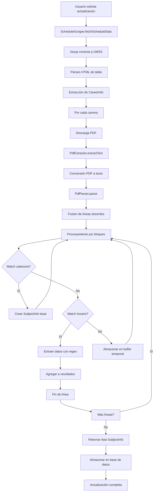

# Scraping y Parsing de PDFs en TecnoTime

## Índice
1. [Introducción](#introducción)
2. [Arquitectura General del Proceso](#arquitectura-general-del-proceso)
3. [Scraping Web con Jsoup](#scraping-web-con-jsoup)
4. [Extracción de Texto de PDFs](#extracción-de-texto-de-pdfs)
5. [Parsing de Datos con Expresiones Regulares](#parsing-de-datos-con-expresiones-regulares)
6. [Flujo Paso a Paso del Proceso](#flujo-paso-a-paso-del-proceso)
7. [Desafíos Técnicos y Soluciones](#desafíos-técnicos-y-soluciones)
8. [Referencias Cruzadas](#referencias-cruzadas)

## Introducción

TecnoTime depende críticamente de la capacidad de obtener datos académicos actualizados desde fuentes externas, específicamente el sitio web oficial de la Universidad Mayor de San Simón (UMSS). El proceso de scraping y parsing de PDFs constituye el núcleo de la funcionalidad de obtención de datos, permitiendo que la aplicación mantenga información precisa sobre carreras, materias y horarios sin intervención manual constante.

Este documento detalla los algoritmos, técnicas y flujos implementados para extraer, procesar y estructurar datos desde documentos PDF oficiales, transformándolos en entidades utilizables por la aplicación.

## Arquitectura General del Proceso

El proceso se divide en tres etapas principales:

1. **Scraping Web**: Extracción de metadatos y URLs de PDFs desde el sitio web de la UMSS
2. **Extracción de Texto**: Conversión de PDFs a texto plano utilizando bibliotecas especializadas
3. **Parsing Inteligente**: Análisis del texto extraído mediante expresiones regulares complejas para identificar y estructurar datos

Cada etapa está encapsulada en clases especializadas (`ScheduleScraper`, `PdfExtractor`, `PdfParser`) siguiendo los principios de responsabilidad única y separación de capas.

## Scraping Web con Jsoup

### Algoritmo de Scraping

El scraping se realiza utilizando la biblioteca Jsoup, que proporciona una API amigable para parseo HTML y navegación DOM. El algoritmo implementado sigue estos pasos:

```kotlin
suspend fun fetchScheduleData(url: String = BASE_URL): List<CareerInfo> =
    withContext(Dispatchers.IO) {
        val result = mutableListOf<CareerInfo>()
        try {
            val doc = Jsoup.connect(url).get()

            // Localización de la tabla objetivo
            val targetTable = doc.select("table").firstOrNull { table ->
                table.select("th").any { it.text().contains("DEPARTAMENTOS", true) }
            } ?: return@withContext emptyList()

            // Procesamiento de filas de datos
            targetTable.select("tr").forEach { row ->
                val td = row.select("td")
                if (td.size >= 4) {
                    // Extracción de código y nombre de carrera
                    val rawDepartment = td[1].text().trim()
                    val match = Regex("""^(\d+)\s+(.+)$""").find(rawDepartment)

                    val code = match?.groupValues?.get(1) ?: return@forEach
                    val name = match.groupValues[2]

                    // Extracción de URL del PDF
                    val pdfHref = td[2].selectFirst("a")?.attr("href") ?: return@forEach
                    val pdfUrl = if (pdfHref.startsWith("http")) pdfHref else BASE_URL + pdfHref

                    val updated = td[3].text().trim()

                    result.add(CareerInfo(code, name, pdfUrl, updated))
                }
            }
        } catch (e: Exception) {
            e.printStackTrace()
        }
        result
    }
```

### Estrategias de Navegación DOM

- **Selección de Tabla Objetivo**: Se identifica la tabla específica mediante la presencia de encabezados que contengan "DEPARTAMENTOS"
- **Procesamiento de Filas**: Cada fila representa una carrera, con columnas para código, nombre, enlace PDF y fecha de actualización
- **Manejo de URLs Relativas**: Las URLs de PDFs se convierten a absolutas cuando es necesario
- **Validación de Datos**: Se descartan filas incompletas o malformadas

### Consideraciones de Robustez

- **Manejo de Errores**: Captura de excepciones de red y parseo
- **Timeouts**: Configuración implícita de Jsoup para evitar bloqueos
- **User-Agent**: Jsoup utiliza un user-agent estándar que simula navegadores modernos

## Extracción de Texto de PDFs

### Uso de PDFBox

La extracción de texto se realiza mediante Apache PDFBox, específicamente la clase `PDFTextStripper`. El proceso es relativamente directo pero requiere manejo cuidadoso de recursos:

```kotlin
suspend fun extractText(pdfFile: File): String = withContext(Dispatchers.IO) {
    PDDocument.load(pdfFile).use { document ->
        PDFTextStripper().getText(document)
    }
}
```

### Características Técnicas

- **Carga Asíncrona**: El proceso se ejecuta en `Dispatchers.IO` para no bloquear el hilo principal
- **Manejo de Recursos**: Uso de `use` para asegurar liberación automática de memoria
- **Texto Plano**: La salida es texto sin formato, perdiendo información de layout pero facilitando el parsing posterior

### Limitaciones de PDFBox

- **Preservación de Layout**: Los PDFs pueden tener layouts complejos que no se traducen perfectamente a texto lineal
- **Codificación**: Problemas potenciales con caracteres especiales o codificaciones no estándar
- **Rendimiento**: Archivos grandes pueden requerir tiempo considerable de procesamiento

## Parsing de Datos con Expresiones Regulares

### Arquitectura del Parser

El `PdfParser` utiliza un conjunto de expresiones regulares (regex) para identificar patrones específicos en el texto extraído. La implementación es compleja debido a la variabilidad en el formato de los PDFs originales.

### Expresiones Regulares Principales

#### 1. Línea de Cabecera de Materia
```kotlin
private val courseLine = Regex("^([A-Z])\\s+(\\d{7})\\s+(.+)$")
```
- **Propósito**: Identificar líneas que contienen nivel, código y nombre de materia
- **Ejemplo**: `"A 2006063 FISICA GENERAL"`
- **Grupos**: (1) Nivel, (2) Código, (3) Nombre

#### 2. Línea de Horario Completa
```kotlin
private val scheduleLine = Regex(
    """
(?x)                              # modo VERBOSE
^\s*
(?<group>(?:[A-Z]\d+|\d+[A-Z]|\d+|[A-Z]))  # (1) grupo: A, 10, A1, 1A
(?:\s+(?<type>\[[A-Z]{1,2}\]))?    # (2) tipo opcional [P],[TP]
\s+(?<teacher>.+?)(?=\s+[A-Z]{2}\s+\d)  # (3) docente (lazy hasta antes de día+hora)
\s+(?<day>[A-Z]{2})                # (4) día: LU, MA, MI…
\s+(?<hour>\d{1,4}\s*-\s*\d{1,4})  # (5) hora, admite espacios
\s+(?<classroom>\S+)               # (6) aula
\s*$
""".trimIndent(),
    RegexOption.COMMENTS
)
```

Esta regex avanzada utiliza:
- **Grupos Nombrados**: Para facilitar la extracción de componentes
- **Lookahead**: Para delimitar el nombre del docente sin consumir caracteres
- **Modo VERBOSE**: Para mejorar legibilidad con comentarios
- **Grupos Opcionales**: Para tipos de clase variables

#### 3. Separador de Bloques
```kotlin
private val blockSeparator = Regex(
    """(?=\b(?:[A-Z]?\d+[A-Z]?|[A-Z])(?:\s+\[[A-Z]{1,2}])?\s+[^\d]+[A-Z]{2}\s+\d{3,4}\s*-\s*\d{3,4}\s+\S+)"""
)
```
- **Propósito**: Separar líneas que contienen múltiples bloques de horario
- **Técnica**: Lookahead positivo para identificar inicios de bloques sin consumir

### Algoritmo de Parsing

El algoritmo principal sigue estos pasos:

1. **Fusión de Líneas**: Combinar líneas partidas de nombres de docentes
2. **Procesamiento por Bloques**: Dividir líneas complejas en bloques individuales
3. **Identificación de Cabeceras**: Detectar líneas de materia nueva
4. **Extracción de Horarios**: Parsear líneas de horario con regex
5. **Manejo de Errores**: Almacenar temporalmente líneas que no match para concatenación posterior

### Técnicas Avanzadas

#### Fusión de Nombres de Docentes
Los nombres largos pueden partirse en múltiples líneas. El algoritmo:
- Acumula líneas consecutivas que no contienen patrones de horario
- Las fusiona cuando encuentra una línea completa de horario
- Maneja casos donde el docente es "POR DESIGNAR"

#### Buffer Temporal
```kotlin
var tempBuffer = ""
// ... procesamiento ...
if (no match) {
    tempBuffer = currentBlock.trim()
}
```

## Flujo Paso a Paso del Proceso



## Desafíos Técnicos y Soluciones

### 1. Variabilidad en Formatos PDF
**Problema**: Los PDFs oficiales pueden cambiar formato entre semestres
**Solución**: Regex flexibles con grupos opcionales y manejo de variaciones

### 2. Nombres de Docentes Partidos
**Problema**: Nombres largos se dividen en múltiples líneas
**Solución**: Algoritmo de fusión que acumula líneas hasta encontrar un patrón completo

### 3. Múltiples Bloques por Línea
**Problema**: Una línea puede contener varios horarios separados
**Solución**: Regex de separación de bloques con lookahead

### 4. Rendimiento con PDFs Grandes
**Problema**: Procesamiento lento de archivos extensos
**Solución**: Ejecución en coroutines IO, procesamiento por bloques

### 5. Codificación de Caracteres
**Problema**: Caracteres especiales en nombres
**Solución**: Uso de UTF-8 y manejo de excepciones

## Referencias Cruzadas

- [docs/arquitectura.md](docs/arquitectura.md): Arquitectura general del sistema
- [docs/funcionalidades.md](docs/funcionalidades.md): Funcionalidades de scraping automático
- [docs/tecnologias.md](docs/tecnologias.md): Tecnologías utilizadas (Jsoup, PDFBox)
- [docs/modelo-datos-er.md](docs/modelo-datos-er.md): Estructura de datos resultante
- [docs/ejemplos-codigo.md](docs/ejemplos-codigo.md): Snippets detallados de regex

Este proceso de scraping y parsing permite a TecnoTime mantener datos actualizados y precisos, formando la base para todas las funcionalidades de generación de horarios inteligentes.